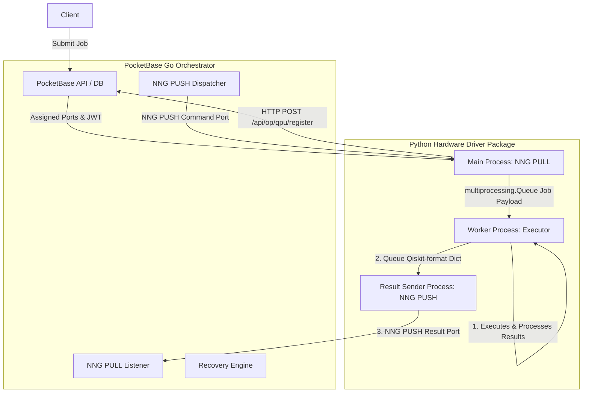

# QPI: Quantum Processing Interface

[](https://github.com/sopherapps/qpi/actions/workflows/ci.yml)
[](https://badge.fury.io/py/qpi-driver)

QPI is a distributed quantum control stack architecture designed to control multiple Quantum Processing Units (QPUs).

## Prerequisites

* **Go**: `>= 1.22` (tested up to `1.26`)
* **Python**: `~= 3.12`

---

## System Architecture

The architecture consists of two primary components:
1. **PocketBase Go Orchestrator (`qpi-interface/main.go`):** Extends PocketBase with Go, handling job queues, session-based bookings, and real-time job dispatching. Actively listens for LAN connections on dynamically allocated network ports.
2. **Python Hardware Driver (`qpi-driver`):** Runs on isolated hardware nodes controlling the QPU. Uses Python's `multiprocessing` library to isolate network handling, quantum circuit compilation/simulation, and translation into separate processes.

To optimize performance and simplify communication over multiprocessing queues, the worker process executes the quantum job, processes the resulting `xarray` dataset into a Qiskit-compatible result dictionary using the executor's `process_result()` method, and directly sends the results via the queue to the result sender process. This removes file-system serialization overhead.



### Key Orchestrator Features
* **Session-Based Booking with Opportunistic FIFO:** Dispatches jobs prioritizing users who have booked the current time slot. Fallback mechanism allows other users' pending jobs to execute if the slot booker is idle.
* **Auto-Schema Migration & Port Allocation:** Automatically creates required database collections (`qpus`, `time_slots`, `quantum_jobs`, `qpu_time_requests`, `notifications`) and dynamically allocates race-free TCP ports for registered QPUs.
* **Stale Job Recovery:** A background ticking routine monitors running jobs and resets them to `pending` if their driver hangs or disconnects (timeout default: 20 seconds).
* **Admin Notifications:** Broadcast or targeted notifications with time-window visibility and per-user dismiss support. Only superusers can create, update, or delete notifications. Authenticated users see only notifications relevant to them (broadcast or targeted) that are within their active time window and not dismissed.

### Orchestrator Configuration Options

The Go orchestrator can be configured via CLI flags, environment variables, or a configuration file (JSON or YAML, specified via `--config-file` or `QPI_CONFIG_FILE`). The precedence hierarchy is: CLI Flag > Env Var > Config File > Default.

| CLI Option | Environment Variable | Default | Description |
|---|---|---|---|
| `--config-file` | `QPI_CONFIG_FILE` | | Path to JSON or YAML configuration file. |
| `--qpus-collection` | `QPI_QPUS_COLLECTION` | `qpus` | Collection name for QPUs. |
| `--timeslots-collection` | `QPI_TIMESLOTS_COLLECTION` | `time_slots` | Collection name for Reservation Time Slots. |
| `--jobs-collection` | `QPI_JOBS_COLLECTION` | `quantum_jobs` | Collection name for Quantum Jobs. |
| `--notifications-collection` | `QPI_NOTIFICATIONS_COLLECTION` | `notifications` | Collection name for Notifications. |
| `--idle-threshold` | `QPI_IDLE_THRESHOLD` | `5s` | Time to wait before running fallback FIFO jobs. |
| `--recovery-interval` | `QPI_RECOVERY_INTERVAL` | `10s` | Interval for resetting hung/stale jobs. |
| `--job-timeout` | `QPI_JOB_TIMEOUT` | `20s` | Max execution time before a job is reset. |
| `--dispatch-poll-interval` | `QPI_DISPATCH_POLL_INTERVAL` | `1s` | Frequency of checking queue for pending jobs. |
| `--port-range-start` | `QPI_PORT_RANGE_START` | `6000` | NNG port range start. |
| `--port-range-end` | `QPI_PORT_RANGE_END` | `7000` | NNG port range end. |
| `--disable-email-password-auth` | `QPI_DISABLE_EMAIL_PASSWORD_AUTH` | `false` | Disable email/password login on the users collection. |
| `--oauth2-providers` | `QPI_OAUTH2_PROVIDERS` | | JSON string representing OAuth2 providers config. |

---

## Orchestrator API & Collections

The orchestrator exposes both **custom HTTP routes** and **PocketBase collection endpoints** for client interaction.

### Custom Routes

| Method | Route | Auth | Description |
|---|---|---|---|
| `POST` | `/api/op/qpu/register` | Registration token | Registers a QPU driver and returns assigned NNG ports + JWT. |
| `POST` | `/api/op/qpu/toggle` | Superuser | Enables or disables a QPU by name. |
| `POST` | `/api/jobs` | Authenticated | Submits a new quantum job. |
| `GET`  | `/api/jobs` | Authenticated | Lists jobs for the authenticated user. |
| `GET`  | `/api/jobs/{id}` | Authenticated | Retrieves a specific job. |
| `POST` | `/api/jobs/{id}/cancel` | Authenticated | Cancels a pending job. |
| `GET`  | `/api/qpus` | Public | Lists all registered QPUs. |
| `GET`  | `/api/qpus/{name}` | Public | Retrieves a specific QPU. |
| `POST` | `/api/tokens` | Authenticated | Creates a new API token. |
| `GET`  | `/api/tokens` | Authenticated | Lists API tokens for the authenticated user. |
| `GET`  | `/api/tokens/{id}` | Authenticated | Retrieves a specific API token. |
| `PATCH`| `/api/tokens/{id}` | Authenticated | Updates an API token (name/expiry). |
| `DELETE`| `/api/tokens/{id}` | Authenticated | Deletes an API token. |
| `PATCH`| `/api/admin/users/{id}` | Superuser | Updates `qpu_seconds` or `api_tokens` on any user. |
| `POST` | `/api/notifications/{id}/dismiss` | Authenticated | Dismisses a notification for the current user. |

### PocketBase Collections

All collection endpoints follow the standard PocketBase REST pattern: `/api/collections/{name}/records`.

| Collection | Auth Rules | Description |
|---|---|---|
| `users` | Owner-only | Authenticated users with `qpu_seconds` balance. |
| `qpus` | Public read; superuser CUD | QPU hardware records with status, ports, and config. |
| `time_slots` | Owner-only CRUD; superuser bypass | Calendar reservations linked to `users`. |
| `quantum_jobs` | Public read; authenticated create | Job queue with payload, status, and results. |
| `qpu_time_requests` | Owner-only CRUD; superuser update | Requests for additional QPU time (pending/approved/rejected). |
| `notifications` | Authenticated read (visibility-filtered); superuser CUD | Admin announcements with broadcast/targeted reach, time windows, and dismiss tracking. |

---

## Python Driver Package (`qpi-driver`)

The Python driver has been modularized as a standard package structure inside the `qpi-driver/` directory.

### Extensible Executors
The package introduces an abstract base `Executor` class (`base.py`) which library users can extend to implement custom hardware/simulator backends:

```python
from qpi_driver import Executor, JobPayload
import xarray as xr

class MyCustomExecutor(Executor):
    def execute(self, payload: JobPayload) -> xr.Dataset:
        # Implement custom control/simulation logic here
        ...
        return xr.Dataset(...)

    def process_result(self, dataset: xr.Dataset, job_id: str) -> dict:
        # Convert dataset to Qiskit-compatible results dict
        ...
        return {"counts": {...}, "shots": ...}
```

Built-in executors include:
* `MockExecutor` (`mock`): Simulates quantum circuits using Qiskit's `BasicSimulator`.
* `QiskitAerExecutor` (`qiskit_aer`): Runs quantum circuit simulations using `qiskit-aer`.
* `QuantifyExecutor` (`quantify`): Executes quantum circuits using `quantify-scheduler` and a Qblox cluster compiler.
* Placeholder executors: `QbloxExecutor` (`qblox`) and `PrestoExecutor` (`presto`).

### Running the Driver for Each Executor

Depending on the backend you wish to run, start the driver using the `--executor` / `-e` option.

#### 1. Mock Executor
Runs simulated measurements without external physics dependencies.
```bash
# Install the package with cli extra
pip install ./qpi-driver[cli]

# Start the driver using mock executor
qpi-driver start --token "my-super-secret-token-12345" --executor "mock"
```

#### 2. Qiskit Aer Simulator
Runs realistic circuit simulations using Qiskit Aer.
```bash
# Install the package with simulator extras
pip install ./qpi-driver[cli,aer]

# Start the driver using qiskit_aer executor
qpi-driver start --token "my-super-secret-token-12345" --executor "qiskit_aer"
```

#### 3. Quantify Executor (Qblox Cluster)
Compiles and runs circuits using `quantify-scheduler`.
* **Dummy/Simulation Mode**: Compiles the schedule and executes it against a dummy local Qblox instrument cluster.
  ```bash
  # Install the package with quantify extra
  pip install ./qpi-driver[cli,quantify]

  # Start driver in dummy mode
  qpi-driver start --token "my-super-secret-token-12345" --executor "quantify" --is-dummy --quantify-hardware-config quantify.hardware.example.json --quantify-deivce-config quantify.deivde.example.json
  ```
* **Real Hardware Mode**: Compiles and deploys to actual physical Qblox hardware.
  ```bash
  # Start driver with a hardware config file
  qpi-driver start --token "my-super-secret-token-12345" --executor "quantify" --quantify-hardware-config quantify.hardware.example.json --quantify-deivce-config quantify.deivde.example.json
  ```

### CLI Usage
The package exposes a command-line interface via `typer`. Options can be passed as CLI arguments/flags or will automatically fall back to their corresponding environment variables.

Common options:
* `-H`, `--host`: Hostname/IP of the Go PocketBase server (env: `GO_SERVER_HOST`, default: `127.0.0.1`).
* `-P`, `--port`: PocketBase HTTP port (env: `GO_SERVER_PORT`, default: `8090`).
* `-t`, `--token`: Registration token matching a `qpus.registration_token` record (env: `REGISTRATION_TOKEN`, required).
* `-n`, `--name`: Human-readable name for this QPU (env: `QPU_NAME`, default: `QPU-Sim-01`).
* `-e`, `--executor`: Which executor backend to use (env: `DRIVER_BACKEND`, default: `mock`).
* `-d`, `--data-dir`: Directory for intermediate NetCDF datasets (env: `QPI_DATA_DIR`, default: `bin/data`).
* `--is-dummy`: Enable/disable dummy/simulation mode (default: `false`).
* `--quantify-hardware-config`: Path to the quantify's hardware-layer config file (JSON/YAML) for the RF control instruments (env: `QPI_QUANTIFY_HARDWARE_CONFIG`, default: `quantify.hardware.json`).
* `--quantify-device-config`: Path to the quantify's device-layer config file (JSON/YAML) for the quantum chip (env: `QPI_QUANTIFY_DEVICE_CONFIG`, default: `quantify.device.yml`).
* `--job-timeout`: the number of seconds to wait for results of the job before timing out (env: `QPI_JOB_TIMEOUT`, default: 10)
* `-d`, `--data-dir`: the path to the folder where experiment data is to be saved (env: `QPI_DATA_DIR`, default: `./bin/data`)

---

## Developer Lifecycle (Makefile)

A `Makefile` is provided in the root directory to simplify development and testing.

```bash
# Build Go binary and install Python package in editable mode
make build

# Run both mock and qiskit_aer end-to-end tests locally
make test

# Clean database, build artifacts, cache files
make clean
```

---

## GitHub Actions CI/CD

The workflow in [.github/workflows/ci.yml](.github/workflows/ci.yml) runs lint checks, unit tests, and E2E integration tests against multiple matrix versions of Go (1.22 to 1.26) and Python (3.12 to 3.14).

If the workflow runs on a `push` to `main`/`master` and the repository environment variable `PUBLISH_TO_PYPI` is set to `true`, the package will automatically build and publish to PyPI.


## TODOs

- [x] Add CRUD (authenticated/authorized) for submitting/viewing/cancelling jobs by users
- [x] Add tracking of QPU time used by a user on job execution (or failure or error)
- [x] Add qiskit-based python client library for submitting jobs, viewing results
- [x] Add CRUD (authenticated/authorized) for submitting/viewing/cancelling booking slots by users
- [x] Add CRUD (authenticated/authorized) for requesting/approving/rejecting/viewing QPU time by users
- [x] Add off/on-switch for QPI-drivers
- [x] Add CRUD for notifications, which can target a list of users or all users (i.e. target_users: empty = broadcast). Users can dismiss a notification for themselves such that when they query for notifications by default, they don't see dismissed notifications. Users can see their own notifications but admins have access to all notifications. Only admins can create/delete/update notifications. Notifications can have a start timestamp and an end timestamp. Before the start and after the end, normal users cannot see them. They have a title and description.
- [ ] Update js,py, and go qpi-clients to use the pocketbase SDK and access all possible routes provided by qpi-interface
- [ ] Add dashboard for viewing jobs, admins allocating QPU time, setting maintenance, scheduling
  announcements, viewing QPU calibration data, viewing job results and statuses (probably using the qpi-client (js)) etc. It needs to be embedded in qpi-interface and served as static files
- [ ] Add support for the Qblox Scheduler (`qblox-scheduler`) package once a stable release is available on PyPI.