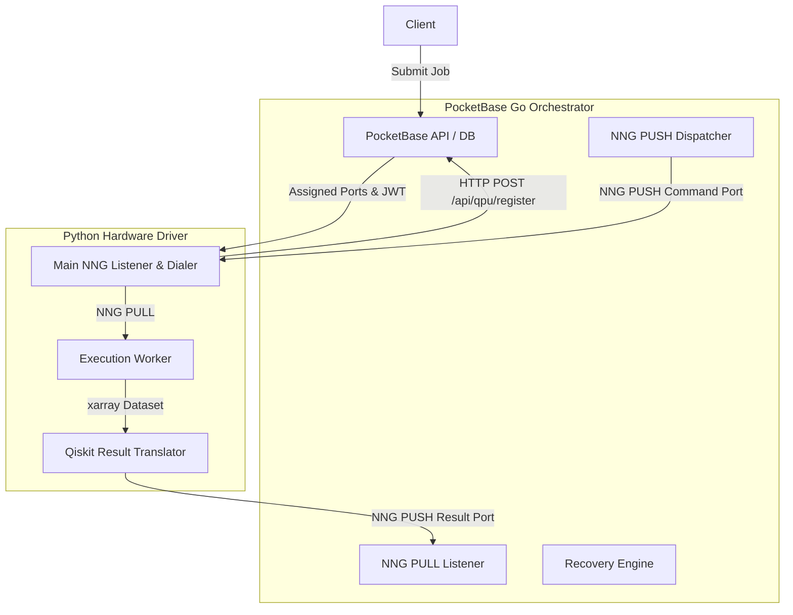

# QPI: Quantum Control Stack Architecture

QPI is a proof-of-concept for a highly concurrent, modular, and authenticated distributed software stack designed to control multiple Quantum Processing Units (QPUs).

## Prerequisites

* **Go**: `>= 1.22` (tested up to `1.26`)
* **Python**: `>= 3.12` (tested up to `3.14`)

## System Architecture

The architecture consists of two primary components:
1. **PocketBase Go Orchestrator (`main.go`):** Extends PocketBase with Go, handling job queues, session-based bookings, and real-time job dispatching. Actively listens for LAN connections on dynamically allocated network ports.
2. **Python Hardware Driver (`driver.py`):** Runs on isolated hardware nodes controlling the QPU. Uses Python's `multiprocessing` library to split network handling, quantum circuit compilation/simulation (mocked via Qiskit), and translation.



### Key Orchestrator Features
* **Session-Based Booking with Opportunistic FIFO:** Dispatches jobs prioritizing users who have booked the current time slot. Fallback mechanism allows other users' pending jobs to execute if the slot booker is idle.
* **Auto-Schema Migration & Port Allocation:** Automatically creates required database collections (`qpus`, `time_slots`, `quantum_jobs`) and dynamically allocates race-free TCP ports for registered QPUs.
* **Stale Job Recovery:** A background ticking routine monitors running jobs and resets them to `pending` if their driver hangs or disconnects (timeout default: 20 seconds).

---

## E2E Integration Testing

An automated end-to-end integration test suite is located in the `e2e` directory and runs on every push or pull request via GitHub Actions.

### Test Workflow
1. Initializes a fresh SQLite database.
2. Registers a QPU and seeds the database with a test user, a booked time slot, and 5 pending jobs.
3. Spawns the PocketBase server and the Python hardware driver in the background.
4. Asserts that all 5 quantum jobs are processed, simulated, and returned with counts successfully.
5. Runs a stale job recovery test by marking a job as `running` with `qpu_target` cleared, then verifying the Recovery Engine successfully resets it to `pending` after the timeout.
6. Cleans up all background processes on exit.

### Running Tests Locally
To run the E2E integration tests locally:

```bash
# 1. Install Python dependencies
pip install -r requirements.txt

# 2. Run the automated script
./e2e/run_tests.sh
```

### GitHub Actions CI
The CI configuration is defined in [.github/workflows/e2e.yml](.github/workflows/e2e.yml).