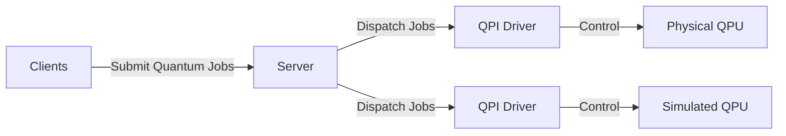

<pre align="center">
 ██████╗ ██████╗ ██╗
██╔═══██╗██╔══██╗██║
██║   ██║██████╔╝██║
██║▄▄ ██║██╔═══╝ ██║
╚██████╔╝██║     ██║
 ╚══▀▀═╝ ╚═╝     ╚═╝
</pre>

<h1 align="center">QPI: Quantum Processing Interface</h1>

<p align="center">
  <a href="https://github.com/sopherapps/qpi/actions/workflows/ci.yml"></a>
  <a href="https://badge.fury.io/py/qpi-driver"></a>
  <a href="https://badge.fury.io/py/qpi-client"></a>
  
</p>

<p align="center">
  <strong><a href="https://sopherapps.github.io/qpi/">📚 Read the Documentation</a></strong> | <strong><a href="https://qpi.sopherapps.se">🚀 Live Demo</a></strong>
</p>

## What is QPI?

QPI is a distributed quantum control stack architecture designed to manage, schedule, and execute quantum circuits across multiple Quantum Processing Units (QPUs). 

It consists of three main components:
1. **Server (`qpi-ui`)**: A Go-based server that manages the job queue, user time-slot bookings, and dispatches jobs to available QPUs. It includes a built-in React web dashboard.
2. **QPU Driver (`qpi-driver`)**: A Python daemon that runs alongside the actual quantum hardware (or simulator), executing incoming jobs from the Server and returning results.
3. **Clients**: SDKs (Python, Go, JS) for end-users to submit OpenQASM (or Qiskit) quantum jobs over the network.



## Installation & Quick Start

QPI is distributed as pre-compiled binaries and OS-specific packages for the server, and a Python package for the drivers and clients.

### 1. Install & Start the Server (`qpi`)

The server is available as a single executable binary, as well as native OS packages (`.deb`, `.rpm`, `.apk`) for Linux distributions.

#### Standalone Binary (macOS & Linux)
Download the binary for your platform, make it executable, and run:
```bash
# macOS (replace 0.1.2 with the version you wish to install)
curl -LO https://github.com/sopherapps/qpi/releases/download/v0.1.2/qpi-0.1.2-darwin-amd64
chmod +x qpi-0.1.2-darwin-amd64 && mv qpi-0.1.2-darwin-amd64 qpi

# Linux (standalone binary)
curl -L https://github.com/sopherapps/qpi/releases/download/v0.1.2/qpi-0.1.2-linux-amd64.tar.gz | tar -xz

# Start the server
./qpi serve
```

#### Native Linux Packages (Ubuntu, Debian, Fedora, Alpine)
For Debian/Ubuntu, download and install the `.deb` package:
```bash
wget https://github.com/sopherapps/qpi/releases/download/v0.1.2/qpi_0.1.2_amd64.deb
sudo apt install ./qpi_0.1.2_amd64.deb
```
*(Note: Installing the package automatically registers and starts `qpi.service` under systemd (or OpenRC on Alpine) to run the server in the background on port `8090`)*

#### Windows
Download the `qpi-windows-amd64.zip` from [GitHub Releases](https://github.com/sopherapps/qpi/releases), unzip it, and run `qpi.exe serve`.

*Once the server is running, the web dashboard is available at `http://127.0.0.1:8090/`. You can log in using the PocketBase Admin UI at `http://127.0.0.1:8090/_/` to create your initial superuser account.*

---

### 2. Connect a QPU Driver (`qpi-driver`)

The driver runs alongside the QPU hardware (or simulation backend) to process jobs from the server.

#### systemd Service (Linux - Recommended)
To install the driver as a persistent background systemd service (mimicking Astral's installation workflow), run the interactive script:

```bash
sudo bash -c "$(curl -LsSf https://raw.githubusercontent.com/sopherapps/qpi/main/qpi-driver/py/install-systemd.sh)"
```

Alternatively, you can run the installer non-interactively by specifying the variables directly:
```bash
curl -LsSf https://raw.githubusercontent.com/sopherapps/qpi/main/qpi-driver/py/install-systemd.sh | sudo \
  QPI_TOKEN="<your-qpu-token>" \
  QPI_ADDR="http://127.0.0.1:8090" \
  CA_FINGERPRINT="<fingerprint>" \
  QPU_NAME="qpu-1" \
  OPERATION="process" \
  DEVICE="mock" \
  bash
```

#### Standalone CLI (macOS, Linux, Windows)
Ensure Python 3.12 is installed, then install using `pip` or `uv`:
```bash
# Install qpi-driver using uv tool (recommended)
uv tool install "qpi-driver[cli]"

# Start the driver daemon
qpi-driver process \
  --qpi-addr http://127.0.0.1:8090 \
  --token "<YOUR_ACCESS_TOKEN>" \
  --ca-fingerprint "<YOUR_CA_FINGERPRINT>" \
  --name "qpu-1" \
  --device "mock"
```

---

### 3. Submit a Job
Users can submit quantum jobs via the Python client:
```bash
pip install qpi-client
```
```python
from qpi_client import QPIClient

client = QPIClient("http://127.0.0.1:8090", api_token="<YOUR_USER_API_TOKEN>")
job = client.submit_job(circuits=[{"circuit": "OPENQASM 2.0; ..."}], shots=100)
print(job)
```

---

## Architecture Deep Dive

The architecture consists of four primary components under the hood:
1. **PocketBase Go Server (`qpi-ui/main.go`):** Extends PocketBase with Go, handling job queues, session-based bookings, and real-time job dispatching. Actively listens for LAN connections on dynamically allocated network ports.
2. **React SPA Dashboard (`qpi-ui/internal/dashboard`):** Single-page application built with Vite, React 19, TypeScript, and Tailwind CSS. It is served directly from the server (via `//go:embed`) at `/` for viewing jobs, allocating QPU time, scheduling announcements, managing bookings, and observing calibration telemetry.
3. **Python QPU Driver (`qpi-driver`):** Runs on isolated hardware nodes controlling the QPU. Uses Python's `multiprocessing` library to isolate network handling, quantum circuit compilation/simulation, and translation into separate processes.
4. **QPI Clients (Python, JavaScript, Go):** SDKs for submitting jobs to the quantum computer using OpenQASM specification (and Qiskit circuits if one uses the Python client)

To optimize performance and simplify communication over multiprocessing queues, the worker process executes the quantum job, processes the resulting `xarray` dataset into a Qiskit-compatible result dictionary using the executor's `process_result()` method, and directly sends the results via the queue to the result sender process. This removes file-system serialization overhead.


### Key Server Features
* **Dashboard Theming:** Fully customizable UI via PocketBase. Superusers can dynamically change the site name, logo, color palettes (light/dark), and inject custom CSS/JS on the fly without recompiling.
* **Session-Based Booking with Opportunistic FIFO:** Dispatches jobs prioritizing users who have booked the current time slot. Fallback mechanism allows other users' pending jobs to execute if the slot booker is idle.
* **Auto-Schema Migration & Port Allocation:** Automatically creates required database collections (`qpus`, `time_slots`, `quantum_jobs`, `qpu_time_requests`, `notifications`) and dynamically allocates race-free TCP ports for registered QPUs.
* **Stale Job Recovery:** A background ticking routine monitors running jobs and resets them to `pending` if their driver hangs or disconnects (timeout default: 20 seconds).
* **Admin Notifications:** Broadcast or targeted notifications with time-window visibility and per-user dismiss support. Only superusers can create, update, or delete notifications. Authenticated users see only notifications relevant to them (broadcast or targeted) that are within their active time window and not dismissed.

### Server Configuration Options

The Go server can be configured via CLI flags, environment variables, or a configuration file (JSON or YAML, specified via `--config-file` or `QPI_CONFIG_FILE`). The precedence hierarchy is: CLI Flag > Env Var > Config File > Default.

| CLI Option | Environment Variable | Default | Description |
|---|---|---|---|
| `--config-file` | `QPI_CONFIG_FILE` | `qpi.config.yml` | Path to JSON or YAML configuration file. |
| `--domain` | `QPI_DOMAIN` | | The domain name this server is running on. |
| `--ip-addr` | `QPI_IP_ADDR` | "127.0.0.1" | The public IP address to include in the generated TLS certificates. |
| `--server-port` | `QPI_SERVER_PORT` | `8090` | The port this server should run on. |
| `--tls-ca-cert-file` | `QPI_TLS_CA_CERT_FILE` | `.qpi.ca.pem` | Path to TLS root CA certificate file. |
| `--tls-ca-key-file` | `QPI_TLS_CA_KEY_FILE` | `.qpi.ca.key` | Path to TLS root CA key file. |
| `--tls-cert-file` | `QPI_TLS_CERT_FILE` | `.qpi.cert.pem` | Path to TLS certificate file. |
| `--tls-key-file` | `QPI_TLS_KEY_FILE` | `.qpi.key` | Path to TLS key file. |
| `--qpus-collection` | `QPI_QPUS_COLLECTION` | `qpus` | Collection name for QPUs. |
| `--timeslots-collection` | `QPI_TIMESLOTS_COLLECTION` | `time_slots` | Collection name for Reservation Time Slots. |
| `--jobs-collection` | `QPI_JOBS_COLLECTION` | `quantum_jobs` | Collection name for Quantum Jobs. |
| `--api-tokens-collection` | `QPI_API_TOKENS_COLLECTION` | `api_tokens` | Collection name for API Tokens. |
| `--notifications-collection` | `QPI_NOTIFICATIONS_COLLECTION` | `notifications` | Collection name for Notifications. |
| `--qpu-time-requests-collection` | `QPI_QPU_TIME_REQUESTS_COLLECTION` | `qpu_time_requests` | Collection name for QPU Time Requests. |
| `--idle-threshold` | `QPI_IDLE_THRESHOLD` | `5s` | Time to wait before running fallback FIFO jobs. |
| `--recovery-interval` | `QPI_RECOVERY_INTERVAL` | `10s` | Interval for resetting hung/stale jobs. |
| `--job-timeout` | `QPI_JOB_TIMEOUT` | `20s` | Max execution time before a job is reset. |
| `--dispatch-poll-interval` | `QPI_DISPATCH_POLL_INTERVAL` | `1s` | Frequency of checking queue for pending jobs. |
| `--port-range-start` | `QPI_PORT_RANGE_START` | `6000` | NNG port range start. |
| `--port-range-end` | `QPI_PORT_RANGE_END` | `7000` | NNG port range end. |
| `--disable-email-password-auth` | `QPI_DISABLE_EMAIL_PASSWORD_AUTH` | `false` | Disable email/password login on the users collection. |
| `--oauth2-providers` | `QPI_OAUTH2_PROVIDERS` | | JSON string representing OAuth2 providers config. |

---

## Server API & Collections

The server exposes both **custom HTTP routes** and **PocketBase collection endpoints** for client interaction.

### Custom Routes

| Method | Route | Auth | Description |
|---|---|---|---|
| `POST` | `/api/op/qpus/create` | Superuser | Creates a new QPU record and returns the generated access token. |
| `POST` | `/api/op/qpus/connect` | Access token | Connects a QPU driver and returns assigned NNG ports + JWT. |
| `POST` | `/api/op/qpu/toggle` | Superuser | Enables or disables a QPU by name. |
| `GET`  | `/api/op/version` | Superuser | Retrieves the application's current version. |
| `POST` | `/api/jobs` | Authenticated | Submits a new quantum job. |
| `GET`  | `/api/jobs` | Authenticated | Lists jobs for the authenticated user. |
| `GET`  | `/api/jobs/{id}` | Authenticated | Retrieves a specific job. |
| `POST` | `/api/jobs/{id}/cancel` | Authenticated | Cancels a pending job. |
| `GET`  | `/api/qpus` | Public | Lists all registered QPUs. |
| `GET`  | `/api/qpus/{name}` | Public | Retrieves a specific QPU. |
| `POST` | `/api/tokens` | Authenticated | Creates a new API token. |
| `GET`  | `/api/tokens` | Authenticated | Lists API tokens for the authenticated user. |
| `GET`  | `/api/tokens/{id}` | Authenticated | Retrieves a specific API token. |
| `PATCH`| `/api/tokens/{id}` | Authenticated | Updates an API token (name/expiry). |
| `DELETE`| `/api/tokens/{id}` | Authenticated | Deletes an API token. |
| `PATCH`| `/api/admin/users/{id}` | Superuser | Updates `qpu_seconds` or `api_tokens` on any user. |
| `POST` | `/api/notifications/{id}/dismiss` | Authenticated | Dismisses a notification for the current user. |

### PocketBase Collections

All collection endpoints follow the standard PocketBase REST pattern: `/api/collections/{name}/records`.

| Collection | Auth Rules | Description |
|---|---|---|
| `users` | Owner-only | Authenticated users with `qpu_seconds` balance. |
| `qpus` | Public read; superuser CUD | QPU hardware records with status, ports, and config. |
| `time_slots` | Owner-only CRUD; superuser bypass | Calendar reservations linked to `users`. |
| `quantum_jobs` | Public read; authenticated create | Job queue with payload, status, and results. |
| `qpu_time_requests` | Owner-only CRUD; superuser update | Requests for additional QPU time (pending/approved/rejected). |
| `notifications` | Authenticated read (visibility-filtered); superuser CUD | Admin announcements with broadcast/targeted reach, time windows, and dismiss tracking. |

---

## Python Driver Package (`qpi-driver`)

The Python driver has been modularized as a standard package structure inside the `qpi-driver/` directory.

### Extensible Executors
The package introduces an abstract base `Executor` class (`base.py`) which library users can extend to implement custom hardware/simulator backends:

```python
from qpi_driver import Executor, JobPayload
import xarray as xr

class MyCustomExecutor(Executor):
    def execute(self, payload: JobPayload) -> xr.Dataset:
        # Implement custom control/simulation logic here
        ...
        return xr.Dataset(...)

    def process_result(self, dataset: xr.Dataset, job_id: str) -> dict:
        # Convert dataset to Qiskit-compatible results dict
        ...
        return {"counts": {...}, "shots": ...}
```

Built-in executors include:
* `MockExecutor` (`mock`): Simulates quantum circuits using Qiskit's `BasicSimulator`.
* `QiskitAerExecutor` (`qiskit_aer`): Runs quantum circuit simulations using `qiskit-aer`.
* `QuantifyExecutor` (`quantify`): Executes quantum circuits using `quantify-scheduler` and a Qblox cluster compiler.
* `QbloxExecutor` (`qblox`): Executes quantum circuits using `qblox-scheduler` and a Qblox cluster compiler.
* Placeholder executors: `PrestoExecutor` (`presto`).

### Running the Driver for Each Executor

A QPU is a `process` driver; pick the backend with the `--device` / `-d` option. Backend-specific settings (dummy mode, quantify config files) are passed as repeatable `-o key=value` options.

#### 1. Mock Executor
Runs simulated measurements without external physics dependencies.
```bash
# Install the package with cli extra
pip install ./qpi-driver[cli]

# Start the driver using the mock device
qpi-driver process --token "my-super-secret-token-12345" --ca-fingerprint "<fingerprint>" --device "mock"
```

#### 2. Qiskit Aer Simulator
Runs realistic circuit simulations using Qiskit Aer.
```bash
# Install the package with simulator extras
pip install ./qpi-driver[cli,aer]

# Start the driver using the qiskit_aer device
qpi-driver process --token "my-super-secret-token-12345" --ca-fingerprint "<fingerprint>" --device "qiskit_aer"
```

#### 3. Quantify Executor (Qblox Cluster)
Compiles and runs circuits using `quantify-scheduler`.
* **Dummy/Simulation Mode**: Compiles the schedule and executes it against a dummy local Qblox instrument cluster.
  ```bash
  # Install the package with quantify extra
  pip install ./qpi-driver[cli,quantify]

  # Start driver in dummy mode
  qpi-driver process --token "my-super-secret-token-12345" --ca-fingerprint "<fingerprint>" --device "quantify" -o is_dummy=true -o quantify_hardware_config=quantify.hardware.example.json -o quantify_device_config=quantify.device.example.json
  ```
* **Real Hardware Mode**: Compiles and deploys to actual physical Qblox hardware.
  ```bash
  # Start driver with a hardware config file
  qpi-driver process --token "my-super-secret-token-12345" --ca-fingerprint "<fingerprint>" --device "quantify" -o quantify_hardware_config=quantify.hardware.example.json -o quantify_device_config=quantify.device.example.json
  ```

#### 4. Qblox Executor (Qblox Cluster)
Compiles and runs circuits using `qblox-scheduler`.
* **Dummy/Simulation Mode**: Compiles the schedule and executes it against a dummy local Qblox instrument cluster.
  ```bash
  # Install the package with qblox extra
  pip install ./qpi-driver[cli,qblox]

  # Start driver in dummy mode
  qpi-driver process --token "my-super-secret-token-12345" --ca-fingerprint "<fingerprint>" --device "qblox" -o is_dummy=true -o quantify_hardware_config=quantify.hardware.example.json -o quantify_device_config=quantify.device.example.json
  ```
* **Real Hardware Mode**: Compiles and deploys to actual physical Qblox hardware.
  ```bash
  # Start driver with a hardware config file
  qpi-driver process --token "my-super-secret-token-12345" --ca-fingerprint "<fingerprint>" --device "qblox" -o quantify_hardware_config=quantify.hardware.example.json -o quantify_device_config=quantify.device.example.json
  ```

### CLI Usage
The package exposes a command-line interface via `typer`. A driver is run by its operation subcommand — `process` (a QPU) or `monitor` (e.g. a cryostat) — on a specific `--device`. Options can be passed as flags or fall back to their environment variables.

Universal options (shared by every operation):
* `-a`, `--qpi-addr`: Full URL of the QPI server (env: `QPI_ADDR`, default: `http://127.0.0.1:8090`).
* `-t`, `--token`: Access token identifying the driver (env: `QPI_ACCESS_TOKEN`, required).
* `-n`, `--name`: Human-readable name for this driver (env: `QPI_DRIVER_NAME`).
* `-d`, `--device`: Which backend to run within the operation, e.g. `mock`, `qblox`, `bluefors_gen1` (env: `QPI_DEVICE`).
* `--ca-file`: Path to the downloaded root CA certificate of the server (env: `QPI_CA_FILE`, default: `./bin/qpi.ca.pem`).
* `--ca-fingerprint`: Fingerprint pinning the server's root CA; shown after creating the QPU/driver in the dashboard (env: `QPI_CA_FINGERPRINT`, required).
* `-o`, `--option`: Operation-specific config as `key=value`, repeatable.

`process` options (`-o`): `data_dir` (default `./bin/data`), `is_dummy` (default `false`), `job_timeout` (seconds, default `10`), `quantify_hardware_config`, `quantify_device_config`, `use_sdk` (run on the experimental driver framework).

`monitor` options (`-o`) for `bluefors_gen1`: `channels` (required, `path[:unit],…`), `base_url`, `api_key`, `poll_interval`, `timeout`.

---

## Developer Lifecycle (Makefile)

A `Makefile` is provided in the root directory to simplify development, linting, formatting, and testing.

```bash
# Build Go binary (automatically compiles the React dashboard) and sync Python driver package
make build

# Run all unit tests and end-to-end integration tests (clients and driver)
make test

# Run only Python driver unit tests
make test-py

# Run dashboard Cypress E2E tests (PocketBase + Driver + Cypress)
make test-e2e-dashboard

# Run linters across Go, Python driver, JS client, and dashboard codebases
make lint

# Automatically format all source files in the repository
make format

# Clean database, build artifacts, cache files
make clean
```

## TODOs

## License

Copyright (c) 2026 [Martin Ahindura](https://github.com/Tinitto)

Licensed under the [MIT License](https://github.com/sopherapps/qpi/blob/main/LICENSE)


## Gratitude

> "What is more, I consider everything a loss because of the surpassing worth of knowing Christ Jesus
> my Lord, for whose sake I have lost all things"
>
> -- Philippians 3: 8
