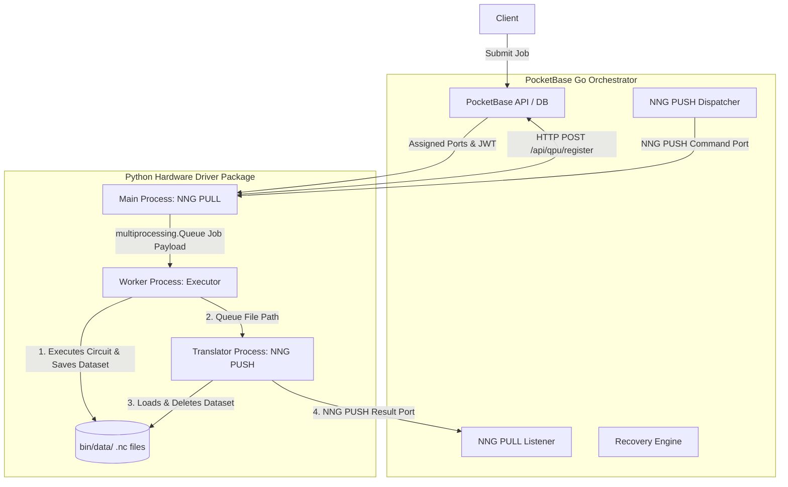

# QPI: Quantum Processing Interface

QPI is a distributed quantum control stack architecture designed to control multiple Quantum Processing Units (QPUs).

## Prerequisites

* **Go**: `>= 1.22` (tested up to `1.26`)
* **Python**: `>= 3.12` (tested up to `3.14`)

---

## System Architecture

The architecture consists of two primary components:
1. **PocketBase Go Orchestrator (`main.go`):** Extends PocketBase with Go, handling job queues, session-based bookings, and real-time job dispatching. Actively listens for LAN connections on dynamically allocated network ports.
2. **Python Hardware Driver (`qpi-driver`):** Runs on isolated hardware nodes controlling the QPU. Uses Python's `multiprocessing` library to isolate network handling, quantum circuit compilation/simulation, and translation into separate processes.

To avoid pickling overhead over multiprocessing queues, intermediate `xarray` datasets are saved as NetCDF `.nc` files to a local directory (e.g. `bin/data/`) and the filepaths are passed between the worker and translator processes. The translator deletes the files immediately after loading them.



### Key Orchestrator Features
* **Session-Based Booking with Opportunistic FIFO:** Dispatches jobs prioritizing users who have booked the current time slot. Fallback mechanism allows other users' pending jobs to execute if the slot booker is idle.
* **Auto-Schema Migration & Port Allocation:** Automatically creates required database collections (`qpus`, `time_slots`, `quantum_jobs`) and dynamically allocates race-free TCP ports for registered QPUs.
* **Stale Job Recovery:** A background ticking routine monitors running jobs and resets them to `pending` if their driver hangs or disconnects (timeout default: 20 seconds).

---

## Python Driver Package (`qpi-driver`)

The Python driver has been modularized as a standard package structure inside the `qpi-driver/` directory.

### Extensible Executors
The package introduces an abstract base `Executor` class (`base.py`) which library users can extend to implement custom hardware/simulator backends:

```python
from qpi_driver import Executor
import xarray as xr

class MyCustomExecutor(Executor):
    def execute(self, payload: dict) -> xr.Dataset:
        # Implement custom control/simulation logic here
        ...
        return xr.Dataset(...)
```

Built-in executors include:
* `MockExecutor` (`mock`): Simulates random multinomial measurement outcomes.
* `QiskitAerExecutor` (`qiskit_aer`): Runs circuit simulations using `qiskit-aer`.
* Placeholder executors: `QuantifyExecutor` (`quantify`), `QbloxExecutor` (`qblox`), and `PrestoExecutor` (`presto`).

### CLI Usage
The package exposes a command-line interface via `typer`. Options can be passed as CLI arguments/flags or will automatically fall back to their corresponding environment variables.

```bash
# Install the package with CLI and simulator extras
pip install ./qpi-driver[cli,aer]

# Start the driver
qpi-driver start --token "my-super-secret-token-12345" --executor "qiskit_aer"
```

Common options:
* `-H`, `--host`: Hostname/IP of the Go PocketBase server (env: `GO_SERVER_HOST`, default: `127.0.0.1`).
* `-P`, `--port`: PocketBase HTTP port (env: `GO_SERVER_PORT`, default: `8090`).
* `-t`, `--token`: Registration token matching a `qpus.registration_token` record (env: `REGISTRATION_TOKEN`, required).
* `-n`, `--name`: Human-readable name for this QPU (env: `QPU_NAME`, default: `QPU-Sim-01`).
* `-e`, `--executor`: Which executor backend to use (env: `DRIVER_BACKEND`, default: `mock`).
* `-d`, `--data-dir`: Directory for intermediate NetCDF datasets (env: `QPI_DATA_DIR`, default: `bin/data`).

---

## Developer Lifecycle (Makefile)

A `Makefile` is provided in the root directory to simplify development and testing.

```bash
# Build Go binary and install Python package in editable mode
make build

# Run both mock and qiskit_aer end-to-end tests locally
make test

# Clean database, build artifacts, cache files
make clean
```

---

## GitHub Actions CI/CD

The workflow in [.github/workflows/e2e.yml](.github/workflows/e2e.yml) runs E2E integration tests against multiple matrix versions of Go (1.22 to 1.26) and Python (3.12 to 3.14).

If the workflow runs on a `push` to `main`/`master` and the repository environment variable `PUBLISH_TO_PYPI` is set to `true`, the package will automatically build and publish to PyPI.