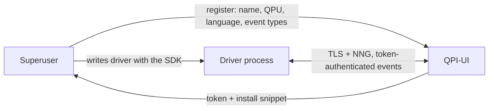

# RFC 0001 — Driver Framework

- **Status:** Draft
- **Author:** Martin Ahindura 
- **Created:** 2026-07-22
- **Touches:** `qpi-ui` (Go/PocketBase), the driver SDKs (Python today), dashboard (React)
- **Issue:** [#25](https://github.com/sopherapps/qpi/issues/25)

## 1. The idea

QPI-UI is an extended PocketBase server holding the metadata for the whole app.
Today it talks to exactly one kind of external process — `qpi-driver`, which runs
quantum jobs. This RFC turns that one hard-wired relationship into a small
framework built on **events**: a superuser registers a driver in the dashboard,
gets a token and a code snippet, and writes a driver against an SDK that mirrors
the events QPI-UI understands. `qpi-driver` is that SDK — the library you build
drivers with; it also ships officially maintained drivers (e.g. the QPU one) as
optional extras.

The author writes **one** thing — a driver. QPI-UI already ships the server (Go)
and UI (React) halves and the handlers for every event; the SDK gives the author
the matching client half to fill in.

## 2. Vocabulary

| Term | Meaning |
| --- | --- |
| **Driver** | An external process registered with QPI-UI that exchanges events with it. Every driver belongs to exactly one **QPU**; a QPU may have many drivers (one runs jobs, another monitors the cryostat, …), like devices and drivers in an OS. |
| **Event** | A typed message, `{ type: EventType, payload: EventPayload }`, that flows in either direction. |
| **Event type** | One of a fixed set defined in a QPI-UI version, each with a server-side handler and a payload shape. Maintainers add more over releases. |
| **SDK** | The base library, one per language (`python`, `typescript`, `go`), that mirrors a version's event types. You build a driver by inheriting from it. Officially maintained drivers ship as optional extras on top of it (e.g. `qpi-driver[cli,qblox]`). |

QPI-UI has a handler for each event it receives; the SDK lets a driver handle events it receives and emit
events of its own.

## 3. How it works



1. **Register** (dashboard): give the driver a name, the **QPU** it belongs to,
   its **language** (dropdown), and its **kind** — one of the known official kinds
   (`mock`, `qiskit_aer`, `quantify`, `qblox`, …) or `CUSTOM`. (This generalises
   today's "Executor Type" dropdown.)
2. **Get a token + snippets.** QPI-UI shows the one-time token once, plus
   ready-to-use setup snippets resolved from the chosen **kind × language**. For an
   official build (e.g. `python` + `qblox`) it offers the two choices the dashboard
   gives today plus one more: a systemd service install, a manual CLI run, and a
   plain install-and-run for those not using systemd — each prefilled with the
   token, address, CA fingerprint and name, and the right extra
   (`qpi-driver[cli,qblox]`). For a pair with no official build (e.g. `go` +
   `qblox`) or any `CUSTOM`, it shows the base install plus a stub with the handlers
   to fill in. The kind→extra mapping and which pairs have official builds are a
   small static catalog the dashboard already holds (it ships with QPI-UI) —
   formalising what `qpi-driver/install-systemd.sh` does today (e.g. `qblox` →
   `qpi-driver[cli,qblox]`, `qiskit_aer` → `[cli,aer]`, else `[cli]`) and adding
   the language dimension.
3. **Write the driver.** Inherit from the SDK base class, implement handlers for
   the events QPI-UI may send, and call `emit(event)` for events you send up.
4. **Run it.** The driver connects with its token over the existing TLS-secured
   NNG channel. The token identifies the driver — and, because a driver is bound
   to one QPU at registration, everything it does is implicitly scoped to that QPU.

## 4. Events

An event is `{ type, payload }`. Delivery is left to NNG (as today); there is no
application-level ACK/NACK — a handler that rejects an event just logs and drops
it, exactly as the current result listener does with a malformed result.

The driver's QPU is known from its record (via the token), so events need not
carry it; a handler always acts on the calling driver's QPU. The event types that
exist today are just the job flow, generalised:

| Event type | Direction | Payload sketch | Handler does |
| --- | --- | --- | --- |
| `JobDispatch` | UI → driver | `{ job_id, circuits, … }` | Driver runs the job. (Push, scheduler-driven, as today.) |
| `JobResult` | driver → UI | `{ job_id, status, results }` | Updates the job, deducts QPU-seconds; `status` = completed/failed. |

New event types are how the framework grows: a maintainer adding, say, a cryostat
monitoring driver (which does not exist today) would introduce its own driver→UI
event and handler. Such a monitor is a **separate driver**, not part of the QPU
driver.

Illustrative Python SDK shape (the QPU driver):

```python
class MyQPU(QpiDriver):                 # base class mirrors this version's events
    def on_job_dispatch(self, e):       # handle an event QPI-UI sends
        result = self.backend.execute(e.payload)
        self.emit(JobResult(job_id=e.payload["job_id"],
                            status="completed", results=result))
```

A monitoring driver would be its own class emitting its own event on a timer via
`self.every(1.0, …)` + `self.emit(…)` — independent of the QPU driver above.

## 5. What exists today, and what changes

Grounding, so an implementer copies rather than invents:

- **Transport** — `qpi-ui/internal/api/nng.go`: `runDispatcher` (PUSH, UI →
  driver) + `runResultListener` (PULL, driver → UI), both `tls+tcp` via
  `getListener`, with `SetPipeEventHook` flipping online/offline; lifecycles in the
  `activeQPUs` map, started by `StartQPUDistribution`.
- **Registration/handshake** — `handleQPUCreate` / `handleQPUConnect` in
  `api.go`: look up by `db.HashToken`, allocate ports via `findFreePorts`, return a
  one-time token + `ca_fingerprint`; superuser-gated by `HasSuperuserAuth()`.
- **TLS** — server-owned CA (`internal/config`); clients pin the root CA by
  SHA-256 (`_download_root_ca_cert` in `qpi-driver/qpi_driver/driver.py`).
- **Schema** — `qpi-ui/internal/db/migrate.go`: a new collection = a struct in
  `models.go` + one `ensure…` function reflected over `db:`/`type:` tags.
- **Driver runtime** — `driver.py`: handshake → CA download → PULL loop + worker
  subprocess + result PUSH. The `Executor` ABC is the per-event logic in miniature.

What changes: the dispatch/result pair generalises from "jobs only" to "typed
events," carried by one envelope (§6). Job dispatch **stays push** — the scheduler
still decides and QPI-UI sends `JobDispatch`; nothing about the scheduler or
online-detection changes. `qpi-driver` becomes the **Python SDK**, and a QPU
becomes a driver that handles `JobDispatch` and emits `JobResult`. Everything is
additive and behind an `EnableDriverFramework` flag; with the flag off the server behaves
exactly as now.

**Packaging.** `qpi-driver` grows the same per-language layout as `qpi-client`
(`py`, `js`, `go`), each holding that language's base SDK. Today's executors stay
put as optional **extras** that ship ready-to-run drivers — Python keeps
`qpi-driver[cli,qblox]`, `qpi-driver[cli,quantify]`, `[cli,aer]`, and so on, run
exactly as they are today. The extras are opt-in: to build a new driver you depend
on the base package alone, inherit the abstraction, and run it with your token.
The visible change is internal (qpi-driver and qpi-ui internals, plus the new
collections); the install-and-run experience for the official drivers is unchanged.

**Buffering:** unchanged from today. The database is the only durable store — a
failed `JobDispatch` leaves the job `pending` to be re-dispatched; the driver is
marked offline by the pipe hook. There is no app-level queue, and any driver→UI
event is best-effort (dropped if nothing is there to persist it).

## 6. Envelope

One JSON shape on the wire (Go DTO beside `DispatchPayload` in `schema.go`; SDK
dataclass client-side).

```jsonc
{
  "id": "01J...",
  "driver": "drv_ab12",
  "type": "JobResult",
  "ts": "2026-07-22T10:04:05.123Z",
  "payload": { }                 // shape depends on type; validated by the handler
}
```

## 7. Data model

`drivers` and `qpus` stay **separate** collections; a driver points at its QPU.

- **`drivers`** (new — struct in `models.go` + `ensure…` in `migrate.go` behind
  the flag; copy `QPU`) — `name` (req), `qpu` (relation → `qpus`, **required**),
  `kind` (select: official kinds like `qblox`/`quantify`/`mock`/`qiskit_aer`/… or
  `custom`), `language` (select: python/typescript/go), `events` (json: the event
  types it participates in — set from the catalog for official kinds, chosen for
  `custom`; drives routing), `token` (hashed), `status`
  (offline/online/maintenance), `nng_in_port`, `nng_out_port`, `host`, `version`,
  `last_seen`, `enabled`, autodates. A QPU has many drivers; each driver has one QPU.
- **`qpus`** (existing, unchanged) — all current fields stay for the scheduler and
  booking; no new field needed (the link lives on `drivers.qpu`).
- **`events`** (new — the single event log, for tracing what happened) — `source`
  (driver id, or `server`), `driver` (relation), `qpu` (relation), `type`,
  `payload` (json), `ts` (indexed), `created`. Every event is
  recorded here; retention pruning keeps it bounded (§11). Job outcomes still land
  in `quantum_jobs` via the `JobResult` handler, as today — `events` is the trace,
  not the source of truth.

Event **types** are not stored — they live in code: the Go server has a handler
per type, and the dashboard (which ships from the same version) already knows the
types and the kind→snippet catalog it needs. No metadata endpoint is required.

## 8. Job lifecycle (worked example)

1. **Connect.** The driver POSTs its token to the connect endpoint; QPI-UI
   resolves it to the driver record (hence its QPU) and returns the NNG ports + CA
   fingerprint. Once the NNG pipe attaches, the pipe hook marks it online — exactly
   as today. There is no application-level handshake message: identity and QPU come
   from the token.
2. **Dispatch (push, unchanged).** The scheduler picks a pending job for the QPU
   and QPI-UI sends `JobDispatch{ job }` to a driver of that QPU.
3. **Result.** The driver runs the job and emits `JobResult{ job_id, status,
   results }`. The handler applies it to the calling driver's QPU (no cross-QPU
   access is possible), updates `quantum_jobs`, and deducts QPU-seconds.

Every event above is also written to the `events` log for tracing (§7).

## 9. Security

Inherited unchanged: all NNG traffic is TLS; drivers pin the root CA by
fingerprint; tokens are stored hashed; registration/management require
`HasSuperuserAuth()`. QPI-UI never stores or runs driver code — only metadata and
recorded events — so there is no code-shipping risk; the token is the identity
boundary.

Authorising QPU-scoped events is trivial in this model: a driver is bound to
exactly one QPU at registration, so QPI-UI derives the QPU from the token and a
driver simply cannot reference another QPU's records. There is nothing to spoof
and no per-event ownership check to get wrong.

## 10. Dashboard

- **Register/manage drivers** — a full page (GitHub-OAuth-app style) rather than a
  modal, since there is now a one-time token plus several setup snippets to show.
  Fields: name, QPU, kind, language. On save, reveal the token once and the
  kind×language snippets (systemd / manual CLI / install-and-run, or a custom
  stub); show status + `last_seen`.
- **Monitor**: for drivers that report upward (e.g. a future cryostat monitor),
  live charts reading `events` filtered by type/QPU via PocketBase realtime.

## 11. Implementation plan

The phased implementation plan — per-phase objectives, current status, remaining
work, definition-of-done checklists, verification commands, and recommended
cost-effective models — is maintained separately from this RFC.

## 12. Notes

Decided in this draft: no app-level buffering (match today, §5); a single `events`
collection logs every event for tracing, bounded by retention (§7, §11); every
driver belongs to exactly one QPU and a QPU may have many drivers (§2, §7); the
`events` retention window is a `qpi.config.yml` setting (e.g. `eventsRetention:
"720h"`) with env/flag overrides and a sensible default, following the same
precedence as existing durations like `jobTimeout` — so operators tune it per
deployment.
