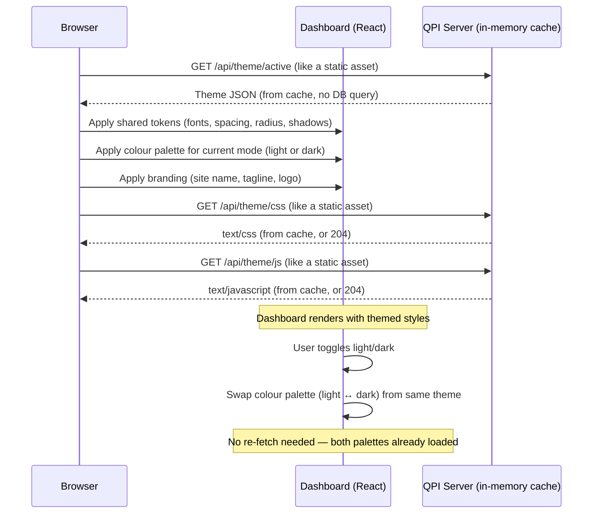

# RFC 0002 — Dashboard Theming

- **Status:** Draft
- **Author:** Martin Ahindura
- **Created:** 2026-07-23
- **Touches:** `qpi-ui` (Go/PocketBase), dashboard (React/Tailwind v4)
- **Issue:** TBD

## 1. The idea

QPI ships a single, hard-coded dashboard look-and-feel. Every deployment looks
identical — same colours, same logo icon, same "QPI Interface" brand text. For
organisations hosting their own QPI instance, this is limiting: a university lab
wants its crest in the sidebar, a startup wants its brand palette, and some
operators want to go further — injecting custom CSS or even JavaScript to reshape
the dashboard without forking the codebase.

This RFC introduces **runtime-customizable theming**. A superuser creates theme
records in a new PocketBase `themes` collection, activates one, and every user's
dashboard immediately picks up the new look. A theme is **self-contained** — it
carries both light-mode and dark-mode colour palettes so the look is uniform
across modes. Themes carry:

1. **Design tokens** — a JSON object with two colour palettes (light and dark)
   plus shared tokens (fonts, spacing, border-radius, shadows, etc.), applied at
   runtime via CSS custom properties.
2. **Branding assets** — logo image (file upload), site/app name, tagline.
3. **Custom CSS and JavaScript** — raw text fields whose contents are served
   by dedicated API endpoints and loaded by the dashboard in `<style>` /
   `<script>` tags, enabling arbitrarily deep customisation without a
   rebuild.

The dashboard's light/dark toggle switches **which colour palette** within the
active theme is applied — fonts, spacing, branding, and custom CSS/JS stay the
same across both modes.

## 2. Vocabulary

| Term | Meaning |
| --- | --- |
| **Theme** | A record in the `themes` collection containing all visual customisation data — both light and dark colour palettes, shared tokens, branding, and custom CSS/JS. A theme is a complete visual identity. |
| **Active theme** | The one theme whose `is_active` flag is `true`. At most one theme is active at any time. |
| **Design tokens** | A JSON object whose keys map to CSS custom properties the dashboard consumes. Colours are split into `light` and `dark` sub-objects; everything else (fonts, spacing, radius, shadows) is shared. |
| **Default theme** | A Go constant (`DefaultThemeTokens`) in the server that defines the compiled-in defaults. This is the single source of truth — the frontend falls back to it when no theme is active, and it pre-populates the admin theme editor form. |
| **Cached theme** | The active theme stored in PocketBase's in-memory app store, refreshed by collection hooks. Theme endpoints read from this cache — never from the database at request time — making them as fast as serving a static file. |
| **Custom CSS** | An arbitrary CSS text block served as a virtual stylesheet by the server. Loaded after the base styles, so it can override anything. Shared across both modes (it can reference CSS custom properties that change per mode). |
| **Custom JS** | An arbitrary JavaScript text block served as a virtual script. Loaded after the app bundle, giving access to the DOM and React root. Shared across both modes. |

## 3. Data model

### 3.1 Default theme constant (Go server)

The Go server defines a `DefaultThemeTokens` variable that is the **single
source of truth** for all dashboard defaults. This is a Go struct that:

- Provides the compiled-in CSS custom property fallback values.
- Is served via the `/api/theme/defaults` endpoint so the frontend admin UI
  can pre-populate the theme editor form with these values.
- Matches the exact structure of the `tokens` JSON field (§3.4).
- Is what the theme endpoints return when no theme is active.

```go
// DefaultThemeTokens is the single source of truth for dashboard design tokens.
var DefaultThemeTokens = ThemeTokens{
    Colors: ThemeColors{
        Light: map[string]string{
            "background":        "#f9fafb",
            "surface":           "#ffffff",
            "surface-dim":       "#f3f4f6",
            "surface-container": "#e5e7eb",
            "primary":           "#111827",
            "secondary":         "#6366f1",
            "success":           "#22c55e",
            "warning":           "#eab308",
            "error":             "#ef4444",
            "border":            "#e5e7eb",
        },
        Dark: map[string]string{
            "background":        "#09090b",
            "surface":           "#18181b",
            "surface-dim":       "#131315",
            "surface-container": "#201f22",
            "primary":           "#ffffff",
            "secondary":         "#6366f1",
            "success":           "#22c55e",
            "warning":           "#eab308",
            "error":             "#ef4444",
            "border":            "#27272a",
        },
    },
    Fonts: map[string]string{
        "sans":    "Inter, sans-serif",
        "mono":    "JetBrains Mono, monospace",
        "display": "Geist, sans-serif",
    },
    Spacing: map[string]string{
        "sidebar-width": "240px",
    },
    Radius: map[string]string{
        "sm":   "0.25rem",
        "md":   "0.375rem",
        "lg":   "0.5rem",
        "full": "9999px",
    },
    Shadows: map[string]string{
        "sm": "0 1px 2px rgba(0,0,0,0.05)",
        "md": "0 4px 6px rgba(0,0,0,0.1)",
    },
}

var DefaultThemeBranding = ThemeBranding{
    SiteName: "QPI Interface",
    Tagline:  "Control Hub",
}
```

**File:** `qpi-ui/internal/config/theme_defaults.go` (new file).

### 3.2 In-memory theme cache (app store)

To avoid querying the database on every page load, the active theme is cached
in PocketBase's in-memory app store — the same mechanism used by `AppConfig`
(`SaveConfigOnApp` / `GetConfigFromApp`).

```go
const appStoreActiveThemeKey = "active_theme"

// SaveActiveThemeOnApp caches the active theme in the app store.
// Pass nil to clear the cache (no active theme).
func SaveActiveThemeOnApp(app core.App, theme *db.Theme) {
    app.Store().Set(appStoreActiveThemeKey, theme)
}

// GetActiveThemeFromApp retrieves the cached active theme.
// Returns nil if no theme is cached (use DefaultThemeTokens as fallback).
func GetActiveThemeFromApp(app core.App) *db.Theme {
    value := app.Store().Get(appStoreActiveThemeKey)
    if value == nil {
        return nil
    }
    theme, ok := value.(*db.Theme)
    if !ok {
        return nil
    }
    return theme
}
```

**Lifecycle:**

1. **Bootstrap (`OnBootstrap`):** after `EnsureSchema`, query the `themes`
   collection for the record with `is_active = true`. If found, call
   `SaveActiveThemeOnApp(app, &theme)`. If not found, the cache stays `nil`
   and the default theme is used.
2. **Create/Update hook (`OnThemeUpsert`):** when a theme is saved with
   `is_active = true`, deactivate all other themes in the DB, then cache the
   new active theme via `SaveActiveThemeOnApp`. When a record that was active
   is saved with `is_active = false`, clear the cache (set `nil`).
3. **Update hook (content change):** when the currently active theme's content
   changes (tokens, CSS, JS, branding, logo), refresh the cache with the
   updated record.
4. **Delete hook:** if the deleted theme was the cached active theme, clear
   the cache.

**Result:** the theme API endpoints (`/api/theme/active`, `/api/theme/css`,
etc.) read from the app store — a single in-memory pointer dereference, no
database query. This makes them as fast as serving a static file.

### 3.3 `themes` collection schema

One new PocketBase collection: **`themes`**.

| Field | Type | Required | Description |
| --- | --- | --- | --- |
| `name` | text | ✓ | Human-readable theme name (e.g. "Quantum Lab"). |
| `is_active` | bool | | Whether this theme is the currently active one. At most one theme is active at any time. |
| `site_name` | text | | The application name shown in the sidebar brand area. Defaults to `DefaultThemeBranding.SiteName` if empty. |
| `tagline` | text | | Short tagline below the site name (defaults to `DefaultThemeBranding.Tagline`). |
| `logo` | file | | Logo image file upload (PNG/SVG/WEBP, max 2 MB). Falls back to the default Cpu icon if empty. |
| `favicon` | file | | Favicon file upload (ICO/PNG/SVG, max 512 KB). Falls back to the default if empty. |
| `tokens` | json | | Design token object. See §3.4 for structure. Omitted keys inherit from `DefaultThemeTokens`. |
| `custom_css` | text (long) | | Raw CSS injected as a `<style>` block after the base stylesheet. Shared across light and dark modes (can reference `--qpi-*` custom properties that change per mode). |
| `custom_js` | text (long) | | Raw JavaScript injected as a `<script>` block after the app bundle. Shared across modes. |
| `created` | autodate | | |
| `updated` | autodate | | |

### 3.4 Design tokens structure

The `tokens` JSON field contains **two colour palettes** (light and dark) plus
shared design tokens. This ensures a theme is fully self-contained — both modes
are defined together, keeping the visual identity uniform except for colour.

```jsonc
{
  // Mode-specific colour palettes
  "colors": {
    "light": {
      "background": "#f9fafb",
      "surface": "#ffffff",
      "surface-dim": "#f3f4f6",
      "surface-container": "#e5e7eb",
      "primary": "#111827",
      "secondary": "#6366f1",
      "success": "#22c55e",
      "warning": "#eab308",
      "error": "#ef4444",
      "border": "#e5e7eb"
    },
    "dark": {
      "background": "#09090b",
      "surface": "#18181b",
      "surface-dim": "#131315",
      "surface-container": "#201f22",
      "primary": "#ffffff",
      "secondary": "#6366f1",
      "success": "#22c55e",
      "warning": "#eab308",
      "error": "#ef4444",
      "border": "#27272a"
    }
  },
  // Shared across both modes
  "fonts": {
    "sans": "Inter, sans-serif",
    "mono": "JetBrains Mono, monospace",
    "display": "Geist, sans-serif"
  },
  "spacing": {
    "sidebar-width": "240px"
  },
  "radius": {
    "sm": "0.25rem",
    "md": "0.375rem",
    "lg": "0.5rem",
    "full": "9999px"
  },
  "shadows": {
    "sm": "0 1px 2px rgba(0,0,0,0.05)",
    "md": "0 4px 6px rgba(0,0,0,0.1)"
  }
}
```

The frontend applies the shared tokens (fonts, spacing, radius, shadows) always,
and swaps only the `colors.light` or `colors.dark` sub-object when the user
toggles modes. Omitted keys inherit from `DefaultThemeTokens`.

### 3.5 API rules

The `themes` collection is publicly readable so that the dashboard can style the login modal before authentication. All mutations are admin-only:

- **ListRule / ViewRule:** `""` (publicly readable).
- **CreateRule / UpdateRule / DeleteRule:** `nil` (superuser-only).

The custom theme endpoints (§4.1) are also **public** (no auth), serving theme data
like static file assets from the in-memory cache.

### 3.6 `is_active` uniqueness enforcement and cache refresh

A PocketBase `OnRecordCreate` / `OnRecordUpdate` hook enforces the invariant
and keeps the in-memory cache in sync:

1. When a theme is saved with `is_active = true`:
   - Set `is_active = false` on any other active theme in the DB.
   - Call `SaveActiveThemeOnApp(app, &theme)` to cache the new active theme.
2. When a theme that was active is saved with `is_active = false`:
   - Call `SaveActiveThemeOnApp(app, nil)` to clear the cache.
3. When the currently active theme's **content** changes (tokens, CSS, JS,
   branding fields, logo, favicon — any field besides `is_active`):
   - Refresh the cache with the updated record.

An `OnRecordDelete` hook clears the cache if the deleted record was the active
theme.

## 4. API endpoints

### 4.1 Theme asset endpoints (public, no auth, cached)

These are custom Go handlers registered on the router. They read from the
in-memory app store cache — **no database queries at request time.** They
serve data as if it were static file assets, with appropriate cache headers.

| Method | Path | Content-Type | Response |
| --- | --- | --- | --- |
| GET | `/api/theme/active` | `application/json` | Returns the cached active theme record (without `custom_css` and `custom_js`). Returns `DefaultThemeTokens` + `DefaultThemeBranding` if no active theme. |
| GET | `/api/theme/defaults` | `application/json` | Returns the server's `DefaultThemeTokens` and `DefaultThemeBranding`. Used by the admin form as pre-populated defaults. |
| GET | `/api/theme/css` | `text/css` | Returns the `custom_css` field of the cached active theme. Empty 204 if no active theme or no custom CSS. |
| GET | `/api/theme/js` | `text/javascript` | Returns the `custom_js` field of the cached active theme. Empty 204 if none. |

**Cache headers:**

All theme endpoints include `Cache-Control: public, max-age=300` (5 minutes).
The browser treats them like static assets — fast to load, reasonable
propagation delay when the admin changes the theme. The `/api/theme/defaults`
endpoint can use a longer `max-age` (e.g. 3600) since it only changes on
server version upgrades.

**Design decisions:**

- CSS and JS are served as separate endpoints rather than inline in the JSON
  response so the browser can cache them independently and the `<link>` /
  `<script>` tags work naturally.
- Custom CSS/JS are **shared** across modes — they can reference `--qpi-color-*`
  custom properties which automatically change when the user toggles modes.
  No per-mode CSS/JS endpoints are needed.
- Logo and favicon files are served via PocketBase's built-in file API
  (`/api/files/themes/{id}/{filename}`), which handles caching headers
  automatically.

### 4.2 Admin endpoints (superuser-only)

Theme CRUD uses the standard PocketBase collection REST API
(`/api/collections/themes/records/...`). No custom admin endpoints are needed —
the existing PocketBase CRUD + the collection rules (§3.5) are sufficient.

The collection hooks (§3.6) run server-side on every create/update/delete,
keeping the in-memory cache in sync transparently.

## 5. Frontend integration

### 5.1 Theme loading lifecycle



1. On boot, the dashboard fetches `/api/theme/active` to get the active
   theme (which contains both colour palettes). This is served from the
   server's in-memory cache — as fast as a static file.
2. Based on the current mode (from `localStorage`), it applies the matching
   colour palette (`tokens.colors.light` or `tokens.colors.dark`) as CSS custom
   properties on `:root`.
3. It applies the shared tokens (fonts, spacing, etc.) regardless of mode.
4. It sets the branding (site name, tagline, logo) from the active theme.
5. It injects the custom CSS as a `<style id="qpi-theme-css">` element in
   `<head>` and the custom JS as a `<script id="qpi-theme-js">` element.
6. When the user toggles modes, the dashboard swaps only the colour palette
   from the same already-fetched theme — **no re-fetch needed**.

### 5.2 CSS custom property bridge

The dashboard's `index.css` defines its design tokens as CSS custom properties
that Tailwind v4's `@theme` directive maps to utilities. The defaults come from
the Go server's `DefaultThemeTokens` values (compiled-in):

```css
@theme {
  --color-background: var(--qpi-color-background, #f9fafb);
  --color-surface: var(--qpi-color-surface, #ffffff);
  --color-primary: var(--qpi-color-primary, #111827);
  --color-secondary: var(--qpi-color-secondary, #6366f1);
  /* ... etc. */
  --spacing-sidebar-width: var(--qpi-spacing-sidebar-width, 240px);
  --font-sans: var(--qpi-font-sans, "Inter", sans-serif);
  --font-mono: var(--qpi-font-mono, "JetBrains Mono", monospace);
}
```

The `var(--qpi-*, <default>)` pattern means the dashboard works with its
built-in defaults when no theme is active, and overrides seamlessly when a
theme sets the `--qpi-*` properties. The dark-mode colour swap is done by
the ThemeContext setting different `--qpi-color-*` values when `.dark` is
toggled.

### 5.3 Theme context

A new React context (`ThemeContext`) exposes the active theme and helpers:

```typescript
interface ThemeContextValue {
  theme: ThemeRecord | null;     // the active theme (contains both palettes)
  siteName: string;              // resolved from theme or default
  tagline: string;
  logoUrl: string | null;
  faviconUrl: string | null;
  isDark: boolean;
  toggleMode: () => void;
  isLoading: boolean;
}
```

Components that need branding info (e.g. `Sidebar`, `LoginModal`, the HTML
`<title>`) consume this context instead of hard-coding strings.

### 5.4 ThemeToggle changes

The existing `ThemeToggle` component gains one responsibility: after toggling
the `dark` class, it also tells the `ThemeContext` to swap the colour palette
(from the same theme). Since both palettes are already loaded, this is an
instant client-side operation — no network fetch.

### 5.5 Admin theme management UI

A new section in the existing **Admin Panel** tab lets superusers:

- List all themes with their active status.
- Create / edit a theme: form fields for name, site name, tagline, logo upload,
  and a token JSON editor pre-populated with the server's `DefaultThemeTokens`
  values (fetched from `/api/theme/defaults`), plus text areas for custom CSS
  and JS.
- Toggle a theme as active (with confirmation, since it affects all users).
- Preview a theme before activating it.
- Delete inactive themes.

## 6. Security

### 6.1 Access control

All theme management (create, update, delete) is restricted to superusers at
the PocketBase collection rule level (`CreateRule / UpdateRule / DeleteRule =
nil`). Read access on the collection is public (`ListRule / ViewRule = ""`) so
that the active theme can be fetched by the dashboard before the user logs in.

The custom theme endpoints (§4.1) are public Go handlers that serve cached
data like static files.

### 6.2 Custom CSS

Custom CSS is admin-authored and served as a static stylesheet. The risk is
minimal — CSS cannot exfiltrate data or execute code (beyond cosmetic damage
like hiding elements). No sanitisation is applied; the admin is trusted.

### 6.3 Custom JS

Custom JavaScript is **more powerful** — it runs in the user's browser with the
same origin as the dashboard, meaning it can access `localStorage`, cookies, and
the PocketBase auth token. This is equivalent to a superuser deploying custom
frontend code.

**Mitigations:**

- **Admin-only creation:** only superusers can write to the `themes` collection
  (API rules, §3.5).
- **Audit trail:** PocketBase's built-in audit log captures who created/updated
  each theme.
- **Opt-in:** the `custom_js` field is optional. Deployments that don't need it
  simply leave it empty.
- **CSP header (recommended):** operators can add a Content-Security-Policy
  header that restricts `script-src` to `'self'`, which would block inline
  scripts. However, since the JS is served from a same-origin endpoint, a
  stricter CSP would need a nonce or hash — a future enhancement if needed.

The philosophy is the same as PocketBase's own admin JS hooks or any CMS
template system: the admin is trusted to not inject malicious code into their
own application.

### 6.4 File uploads

Logo and favicon uploads are constrained by:

- **MIME types:** `image/png`, `image/svg+xml`, `image/webp`, `image/x-icon`.
- **Max size:** logo 2 MB, favicon 512 KB.
- **No execution:** images are served with their actual content type; no path
  traversal is possible (PocketBase handles this).

## 7. What exists today, and what changes

### Today

- **Colours** are hard-coded in `tailwind.config.js` (dark-only palette:
  `background: #09090b`, `surface: #18181b`, etc.) and in `index.css` as
  Tailwind `@layer base` / `dark:` variants.
- **Dark/light toggle** is a `localStorage`-backed class toggle
  (`ThemeToggle.tsx`), flipping `.dark` on `<html>`. The toggle only switches
  Tailwind's `dark:` variant; there is no concept of distinct palettes.
- **Branding** is hard-coded in `Sidebar.tsx` ("QPI Interface", "Control Hub",
  `Cpu` icon) and in `index.html` (`<title>QPI Dashboard — Obsidian
  Precision</title>`).
- **No custom CSS/JS injection** exists.
- **No single source of truth** for design defaults — values are scattered
  across `tailwind.config.js`, `index.css`, and component files.

### After

- A `themes` collection in PocketBase stores n themes, with at most one active.
- Each theme is self-contained: both light and dark colour palettes, shared
  tokens (fonts, spacing, etc.), branding, and custom CSS/JS.
- A Go `DefaultThemeTokens` constant is the single source of truth for defaults.
- The active theme is cached in PocketBase's in-memory app store — theme
  endpoints serve it with zero DB queries, like static files.
- The dashboard fetches the active theme on boot, applies design tokens as CSS
  custom properties, and swaps only the colour palette on light/dark toggle.
- Branding (site name, tagline, logo, favicon) is read from the active theme.
- Custom CSS/JS is loaded from dedicated server endpoints (shared across modes).
- The admin panel gains a theme management section with forms pre-populated from
  the server's defaults.
- **The dashboard still works identically with zero themes configured** — all
  CSS custom properties have compiled-in defaults from `DefaultThemeTokens`, and
  branding falls back to `DefaultThemeBranding`.

## 8. Decisions

1. **Runtime CSS custom properties, not Tailwind recompilation.** Re-running
   Tailwind at runtime would require a Node.js build step on the server. CSS
   custom properties achieve the same visual result with zero build
   infrastructure, at the cost of not supporting arbitrary Tailwind utilities in
   token values (only the token values themselves are overridable). This is
   acceptable — the `custom_css` field covers anything the tokens don't.

2. **Separate CSS/JS endpoints, not inline in JSON.** This lets the browser
   cache them independently, enables `<link>` / `<script>` tag loading, and
   keeps the JSON response for `/api/theme/active` small and fast.

3. **Self-contained themes (both light + dark in one record).** A theme defines
   the complete visual identity — both colour palettes, shared tokens, branding,
   and custom code. This keeps themes uniform across modes and simplifies the
   data model (no `category` field, simpler `is_active` hook).

4. **Single source of truth from Go server.** The `DefaultThemeTokens` constant
   lives in the Go codebase. The frontend CSS defaults, the admin form
   pre-population, and the fallback behaviour all derive from this one
   definition. This prevents drift between backend and frontend defaults.

5. **In-memory cache via app store, not per-request DB queries.** The active
   theme is loaded into `app.Store()` at bootstrap and kept in sync by
   collection hooks. Theme endpoints read from this cache — a single pointer
   dereference — making them as fast as serving static files. The DB is only
   queried once at startup and on admin mutations.

6. **All customization is admin-only.** Theme creation, editing, and deletion
   are restricted to superusers at the PocketBase collection rule level. Read
   access on the collection is public to allow the login modal to be themed
   before authentication. The public `/api/theme/active` custom endpoint
   serves the active theme efficiently from the in-memory cache.

7. **Custom CSS/JS shared across modes.** Since the light/dark toggle only
   changes colour custom properties, custom CSS/JS works identically in both
   modes without needing per-mode variants. Custom CSS can reference
   `--qpi-color-*` properties that automatically reflect the current mode.

8. **Custom JS is opt-in.** The power it provides (arbitrary DOM/cookie access)
   is commensurate with the trust level of a PocketBase superuser. No
   sandboxing (iframe, Web Worker) is applied in v1.

9. **File-based logo/favicon via PocketBase file fields.** This reuses
   PocketBase's existing file storage, thumbnailing, and CDN-friendly serving,
   rather than inventing a custom upload flow.

## 9. Implementation plan

The phased implementation plan — per-phase objectives, status, remaining
work, definition-of-done checklists, verification commands, and recommended
cost-effective models — is maintained in
[`.agents/ROADMAP.md`](../../.agents/ROADMAP.md), separately from this RFC.
