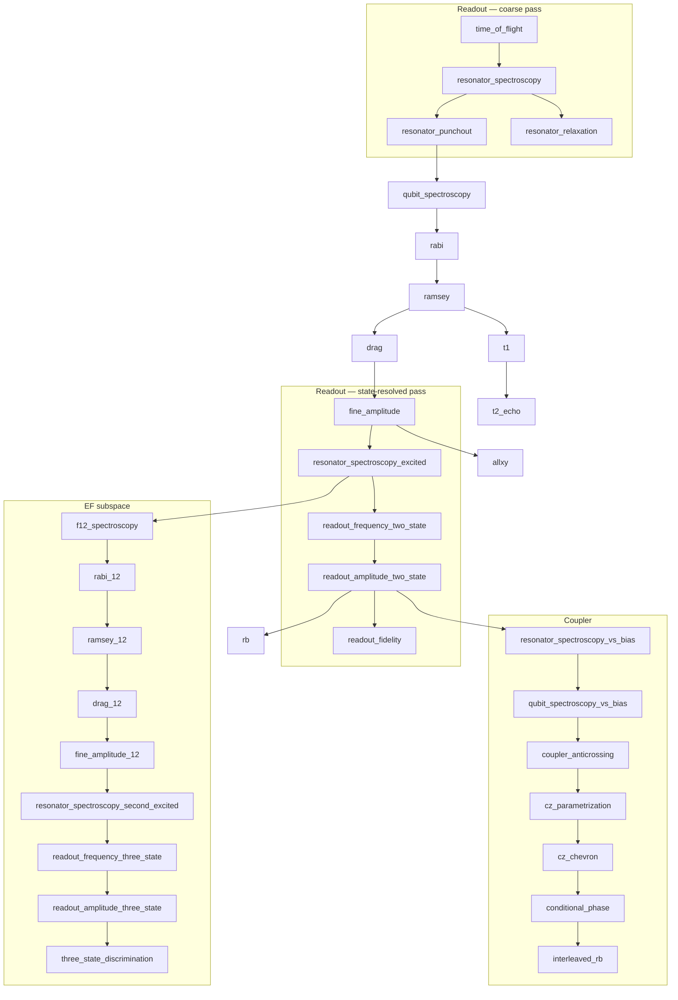

# RFC 0005 — Calibration Graph Completion

- **Status:** Implemented
- **Author:** Martin Ahindura
- **Created:** 2026-07-31
- **Depends on:** RFC 0004 (calibrate operation, tuners, routines, the DAG walk)
- **Touches:** `qpi-driver` (Python only — no new operation, no new event type, no
  server or SDK change)

## 1. The idea

RFC 0004 built the machinery and sixteen routines. The machinery is right; the
graph is not finished. Three things say so, and none of them is a matter of taste:

**The device file has parameters nothing produces.** `measure.acq_rotation` and
`measure.acq_threshold` decide the bit of every `meas_level=2` shot — the default
job path — and no routine writes them. The reference `quantify.device.yml` in this
repo does not carry them at all, so the executor falls back to `0.0`/`0.0` and
discriminates on `Re(z) > 0` with no rotation. There is no reason a readout chain
puts the two clouds either side of that line. The same holds for
`measure.integration_time`, `measure.pulse_duration`, `measure.acq_delay` and
`clock_freqs.f12`.

**The hardware config is provisioned for a larger pipeline than the tuner can
fill.** `qpi-driver/py/quantify.hardware.json` declares, per qubit, clocks named
`01`, `12`, `ro`, `ro1`, `ro2`, `ro_2st_opt` and `ro_3st_opt`. The tuner produces
three of those seven. The other four are the state-resolved readout calibration and
the EF subspace, so a chip wired to that config expects them to exist.

**The readout chain cannot all live at the root.** Measuring the resonance with the
qubit in `|1⟩` needs a calibrated π pulse, so proper readout calibration *depends
on* Rabi, which depends on coarse readout. RFC 0004's graph puts readout entirely
above the qubit chain, so it can only ever do the coarse half. This is a topology
error, not a missing experiment, and it is why the missing nodes cannot simply be
appended.

This RFC completes the graph, and adds the one piece of machinery both reference
pipelines lack: a **check** form per node, so staleness is measured rather than
remembered.

## 2. Vocabulary

Extends RFC 0004 §2.

| Term | Meaning |
| --- | --- |
| **Check** | A cheap measurement answering "is this parameter still right?" without re-deriving it. Distinct from the routine's `calibrate` form, which sweeps. |
| **Diagnose** | The recursion that decides how far *up* the graph to re-calibrate when a check fails (Kelly et al.). |
| **Coarse pass** | Readout calibration possible with no qubit control: find the resonators, pick a working power. |
| **State-resolved pass** | Readout calibration that needs a π pulse: the resonance per qubit state, the optimal drive point between them, and the discriminator. |
| **EF subspace** | The `\|1⟩`–`\|2⟩` transition and its own amplitude, frequency and DRAG parameters. Needed for leakage-aware three-state readout. |

## 3. Background: the reference pipelines

Two prior implementations target this hardware stack, and both are worth reading
for their **node inventory** — hard-won domain knowledge — and not for their
software structure (§11).

- [`tergite-autocalibration`](https://github.com/tergite/tergite-autocalibration) —
  the full pipeline, 32 nodes, `GRAPH_DEPENDENCIES` in `lib/utils/graph.py`.
- [`tergite-tuner`](https://github.com/tergite/tergite-tuner) — a trimmed
  reimplementation of the same graph for *recalibration only*, with
  `DEFAULT_NODE_DAG_EDGES` in `lib/nodes/__init__.py`. It omits the coupler bias
  currents, which is the boundary of what recalibration alone can fix.

### Provenance and licensing

Both are **Apache License 2.0**, © Chalmers Next Labs and the named contributors in
their file headers. qpi is **MIT**. The two are not interchangeable, so the boundary
matters and is recorded here rather than left to be reconstructed later.

**What this RFC takes: facts, not code.** The node names, the dependency edges, the
calibrated parameter names, and the observation that neither package implements a
check/calibrate split. Those describe a physical calibration order and an interface;
they are not expression, and nothing has been copied. §11 lists the parts of their
*design* qpi deliberately rejects, which is the opposite of borrowing.

**If any implementation is ever ported**, the rule is not "rewrite the header":

- Apache 2.0 is not relicensable as MIT. A ported file stays under Apache 2.0, keeps
  its copyright notice and license reference, and must state that it was modified.
- qpi would need a third-party notices file — the tergite repos use `CREDITS.md`;
  qpi has none today — and `LICENSE` would need to say that some files are Apache
  2.0. Apache 2.0 also carries a patent grant and termination clause MIT does not.
- Accepting Apache-2.0 code into an MIT project is a **maintainer's decision**, not
  an implementer's. It should be made deliberately, once, and written down.

Their own tree shows the correct pattern: the two-qubit Clifford utilities under
`tqg_randomized_benchmarking/utils/` are vendored from the DiCarlo lab (© 2016
QuTech, Delft) under MIT, with the upstream header preserved verbatim inside an
otherwise Apache-2.0 repository.

The one place qpi and they could plausibly have converged is randomized
benchmarking, and they have not: `qpi_driver/tuners/utils/clifford.py` builds the
24-element group by exact matrix composition and derives each recovery gate, with no
lookup tables and no borrowed code. Two of the nodes below — `cz_rb`-equivalents —
are the next place that temptation will arise, so the check above is worth repeating
at that point.

Their graphs agree, and both confirm the straddle:

```
n_rabi_oscillations → resonator_spectroscopy_1
                    → ro_frequency_two_state_optimization
                    → ro_amplitude_two_state_optimization
```

Readout amplitude is calibrated **there**, against discrimination fidelity — not by
punchout. `punchout` sits in `EXCLUDED_NODES` in autocalibration, marked standalone.
RFC 0004 makes punchout the producer of `measure.pulse_amp`, which is the weaker
choice; §4 records the decision.

They also calibrate a number RFC 0004 hardcodes. `spec:spec_ampl_optimal` is the
*spectroscopy drive amplitude*, found by a node
(`qubit_bring_up_spectroscopy`). RFC 0004 §11 records that qpi's 1% default is a
signal-to-noise of about five and that the full-DAG test was passing on that
margin; the reference pipelines treat it as a calibrated parameter, and they are
right.

**Neither implements check-vs-calibrate.** Both persist a `calibrated` /
`not_calibrated` flag — autocalibration in redis via
`_check_calibration_status_redis`, and qpi's `RECALIBRATION_ROOTS =
("qubit_spectroscopy",)` is the same idea with the boundary hardcoded instead of
stored. Kelly et al., [*Physical qubit calibration on a directed acyclic
graph*](https://arxiv.org/abs/1803.03226) (arXiv:1803.03226) is the citable
formalism for doing better: per-node `check_data` and `check_state`, and a
`diagnose` recursion that walks up only as far as the evidence requires. This is
the part reviewers will press on hardest, because it is the difference between a
graph and a script.

## 4. Decisions

| Decision | Resolution |
|---|---|
| New operation or event type? | **No.** `calibrate` already carries this. Python driver only. |
| Routine interface | **Unchanged.** `build_schedule` / `analyse` / `apply` absorbs every new node. If a node does not fit, that is a finding to record, not a reason to add a second interface. |
| Where parameters live | **Unchanged** — dotted paths on the real `QuantumDevice`, written to `quantify.device.yml` through the verified write-back. No key–value store. §11. |
| Readout amplitude producer | Move from `resonator_punchout` to `readout_amplitude_two_state`, which optimises it against assignment fidelity. Punchout keeps `clock_freqs.readout` and becomes a **check** node for the dressed regime. |
| Spectroscopy drive amplitude | Becomes a calibrated parameter (`spec.amplitude`), measured by `qubit_spectroscopy` itself as a second sweep axis rather than by a node of its own — **revised during implementation, see below**. |
| EF subspace | In scope. It is seven nodes and the only route to leakage-aware readout, which the hardware config already expects. |
| Coupler bias current | In scope. `bias.parking_current` is carried, validated and applied today, and set by hand. |
| Check / diagnose | In scope, and first — it needs no new physics and it changes what every other node must provide. |
| Crosstalk | **Out of scope.** Largest, most deferrable, and nothing in the device file depends on it yet. |
| Mixer calibration | **Out of scope.** RF modules; out-of-band like the SPI rack. |
| Code from the reference pipelines | **None.** Facts and interface names only; they are Apache 2.0 and qpi is MIT. Porting any implementation needs a maintainer decision first — §3, *Provenance and licensing*. |

## 5. The gap, concretely

Every readout and qubit parameter the executor or a later routine consumes, and
what produces it today.

| Parameter | Consumed by | Produced today |
|---|---|---|
| `clock_freqs.readout` | every schedule | ✅ `resonator_spectroscopy`, corrected by `resonator_punchout` |
| `clock_freqs.f01` | every drive | ✅ `qubit_spectroscopy` → `ramsey` |
| `clock_freqs.f12` | EF drive, 3-state readout | ❌ nothing — hardcoded in the fixture, 134 MHz from the simulated transmon |
| `clock_freqs.readout_1` / `_2` | readout optimisation | ❌ nothing |
| `clock_freqs.readout_2state_opt` / `_3state_opt` | optimal readout | ❌ nothing |
| `measure.pulse_amp` | every readout | ⚠️ `resonator_punchout` — dressed-regime edge, not fidelity |
| `measure.acq_rotation` | **every `meas_level=2` shot** | ❌ nothing; absent from a working chip's config → `0.0` |
| `measure.acq_threshold` | **every `meas_level=2` shot** | ❌ nothing; absent from a working chip's config → `0.0` |
| `measure.integration_time` | every acquisition | ❌ hand-set (3.6 µs) |
| `measure.pulse_duration` | every readout | ❌ hand-set (3.8 µs) |
| `measure.acq_delay` | every acquisition | ❌ hand-set (200 ns) |
| `rxy.amp180`, `rxy.motzoi` | every gate | ✅ `rabi`/`fine_amplitude`, `drag` |
| `r12.ef_amp180`, `r12.ef_motzoi` | EF gates | ❌ nothing |
| `spec.amplitude` | `qubit_spectroscopy` itself | ❌ hardcoded default |
| `cz.square_amp`, `cz.square_duration`, phase corrections | every CZ | ✅ `cz_chevron`, `conditional_phase` |
| `bias.parking_current` | applied at driver startup | ❌ hand-set |

Two of these are worse than "missing": the discriminator pair silently defaults,
and `f12` is silently wrong. A missing parameter that raises is a nuisance; one
that defaults is a wrong answer with no symptom.

## 6. The target graph

> This is the plan. The graph as built differs in four places, all recorded in
> §14 — read that for what actually runs.



`flux_spectroscopy` is subsumed by `qubit_spectroscopy_vs_bias`, which measures the
same arc against a swept coupler bias rather than a pulsed flux offset. Keeping both
would be two names for one experiment.

## 7. Node inventory

Sixteen existing nodes keep their names, dependencies and written parameters except
where §4 says otherwise. The new ones, in dependency order, with the simulator
capability each requires — because a node the simulator cannot pose is a node we
cannot claim. Names and written parameters moved during implementation; §14 is the
inventory as built.

| Node | Writes | Simulator needs |
|---|---|---|
| `time_of_flight` | `measure.acq_delay` | ✅ a propagation delay before the acquisition window |
| `resonator_relaxation` | — (reports the linewidth) | ✅ the ring-up, already present in `_trace` |
| `qubit_spectroscopy` (2nd axis) | `spec.amplitude` | nothing new; the line power-broadens already |
| `readout_discrimination` | `measure.acq_rotation`, `measure.acq_threshold` | ✅ the dispersive pull, plus a chain rotation so `0`/`0` is not right by construction |
| `resonator_spectroscopy_excited` | `clock_freqs.readout_1` | ✅ **the dispersive pull** — resonance per qubit state |
| `readout_frequency_two_state` | `clock_freqs.readout_2state_opt` | the pull, plus separation as a function of drive frequency |
| `readout_amplitude_two_state` | `measure.pulse_amp`, `measure.acq_rotation`, `measure.acq_threshold` | ✅ blob positions derived from the response, **scaled by the drive amplitude** so more power buys more signal and punch-through is a real cost rather than the only one |
| `readout_fidelity` | — (characterisation) | assignment errors from the overlap of the two distributions |
| `f12_spectroscopy` | `clock_freqs.f12` | ✅ the `.12` clock driven; the three-level ladder was already real |
| `rabi_12`, `ramsey_12`, `drag_12`, `fine_amplitude_12` | `r12.ef_amp180`, `clock_freqs.f12`, `r12.ef_motzoi` | drive on the `.12` clock; leakage to `|3⟩` bounded or a fourth level |
| `resonator_spectroscopy_second_excited` | `clock_freqs.readout_2` | a **second** dispersive shift, for `|2⟩` |
| `readout_frequency_three_state`, `readout_amplitude_three_state`, `three_state_discrimination` | `clock_freqs.readout_3state_opt`, `measure_3state.*` | three resolvable clouds, so leakage is a third outcome rather than "not `|0⟩`" |
| `resonator_spectroscopy_vs_bias` | coupler arc via the resonator | resonator frequency responding to coupler bias |
| `qubit_spectroscopy_vs_bias` | coupler arc via the qubit | qubit frequency responding to coupler bias |
| `coupler_anticrossing` | `bias.parking_current` | **a coupler with its own frequency**, not just an exchange rate |
| `cz_parametrization` | CZ operating-point candidates | the above; replaces two of RFC 0004 §7's chosen constants with measured ones |

The bottom four are where RFC 0004 §7's honesty caveat bites hardest: `G_MHZ`,
`FLUX_CURVATURE_GHZ`, `SIDEBAND_GAP_GHZ`, `STARK_SHIFT_MHZ` and `STARK_ASYMMETRY`
are chosen numbers, and a coupler-bias node is exactly the experiment that would
measure two of them. Until the coupler has a frequency of its own, a
`coupler_anticrossing` result reads as "the routine recovers the parking point of a
plausible coupler".

## 8. Check versus calibrate

Every routine gains an optional `check` alongside `calibrate`. The contract:

- `check` runs a **short** schedule and returns a boolean plus a measured margin.
  It may not write parameters.
- `check` is allowed to be absent. A node without one is always treated as stale,
  which is today's behaviour, so this is additive.
- `diagnose(node)` walks: if a node's check passes, stop; if it fails, check its
  dependencies, and recalibrate the shallowest node whose own dependencies all pass.

Two consequences worth stating in advance:

`RECALIBRATION_ROOTS` becomes a fallback rather than the answer, under the name
`RECALIBRATION_SEEDS`. It existed because there was no way to ask whether the
readout is still good, so the answer was hardcoded to "assume it is". With a check
on `resonator_spectroscopy` the graph can decide, and a readout drift stops being
invisible. It does not disappear outright — with no checks anywhere, blame stops at
the seed, which reproduces RFC 0004's behaviour exactly and is what makes the whole
change additive.

Checks make the drift interval cheaper, not just smarter. RFC 0004's drift check
runs benchmarks and infers; a per-node check measures the parameter, so a failure
names the node instead of the qubit.

### The asymmetry that makes it safe

*Unknown is not failure.* A node with no check, or whose check raised, is unknown,
and `diagnose` may not blame it. Without that rule every diagnose would walk to the
root — since most nodes have no check — and a partial recalibration would cost more
than a full one.

The rule has a price, and it is worth naming because it was paid immediately: an
unevaluable check reports **nothing, forever, in silence**. The first version of
`resonator_spectroscopy`'s check read its tolerance from
``measure.readout_linewidth``, a path no transmon element has, so `read_path` raised
`ParameterError` every time and the check was dead on arrival with no failing test.
The guard is a tier-2 test requiring every check schedule to *build and compile*
against a real device, since building is where a check reads what it is judging.

That also settles where the linewidth comes from: a constant with a config override,
because `fit_resonator_spectroscopy` measures a linewidth and nothing stores it —
neither scheduler's transmon has a field for one. §13 asks whether to add one.

## 9. Simulator capabilities

RFC 0004 §7 sets the bar: a routine we cannot pose to the simulator is a routine we
cannot claim works. Completing the graph therefore needs the simulator extended
first, in this order.

1. **Dispersive readout.** Resonance per qubit state (`|0⟩`, `|1⟩`, `|2⟩`), and blob
   positions derived from that response rather than the two hand-placed constants
   `GROUND_IQ`/`EXCITED_IQ`. Those were chosen to straddle `Re = 0`, which makes the
   discriminator's right answer `0/0` *by construction* — so a discriminator routine
   tested against them would rediscover a number we planted. A readout-chain rotation
   and offset is part of this, for the same reason.
2. **A propagation delay**, so `time_of_flight` has something to find.
3. **The `.12` clock**, so the EF chain can be driven. The three-level ladder and
   its leakage are already real; only the clock plumbing is missing.
4. **A coupler with a frequency**, biased by a current, so the flux arcs and the
   parking point are measurements rather than constants.

Items 1 and 4 are the substance. Item 1 reverses a claim RFC 0004 §7 currently
makes — that a dispersive model is unnecessary — and the reversal is correct: it was
unnecessary only because the routines that need it were absent.

## 10. Testing strategy

Extends RFC 0004 §7 rather than replacing it. Three additions:

- **The full-DAG loop test grows with the graph.** `test_calibration_loop.py`
  already requires the report to come back `success` having skipped *no* routine.
  That assertion is what makes a new node's absence a failure, so it stays as an
  equality and every new node joins it.
- **Every new parameter needs a consumer in the test.** A node that writes a value
  nothing later reads proves nothing. `acq_rotation`/`acq_threshold` are the model
  here: the test should calibrate them on a chip whose blobs are *not* at `0/0` and
  then require `meas_level=2` counts to be right — which fails today.
- **`diagnose` gets tier-1 tests.** It is graph logic, so it belongs with
  `test_calibration_dag.py` and needs no simulator: a fabricated graph with scripted
  check outcomes, asserting which nodes were recalibrated.

## 11. What we deliberately do not take from the reference pipelines

Recorded because the temptation is real and the reason is not obvious from reading
them: both packages optimise for physics throughput, and qpi optimises for a
calibration a `process` driver can trust. Where they differ, qpi's choice is
deliberate.

- **A key–value store as the parameter store.** Both write redis fields like
  `"clock_freqs:readout"` — strings, unvalidated, with the device object
  reconstructed from them afterwards. qpi writes dotted paths onto the real
  `QuantumDevice` and persists *that*, so a wrong name raises at the write instead
  of surviving as a key nobody reads. This is what caught `cz.amp`,
  `cz.phase_correction` and `rxy.motzoi`-under-qblox (RFC 0004 §11); a string store
  would have accepted all three.
- **The measurement / analysis / node triple.** Three files and three classes per
  node. qpi's one `CalibrationRoutine` with `build_schedule`, `analyse` and `apply`
  holds the same content where a reader can see it at once, and the DAG needs no
  factory to assemble it.
- **Class discovery by AST crawling.** `NodeFactory` walks the package looking for
  `BaseNode` subclasses and maps snake_case names to them. qpi's `all_routines()` is
  an explicit list; a node that is not in it does not exist, which is the property
  you want when a missing node means an uncalibrated chip.
- **Split sample spaces.** `schedule_samplespace` versus `external_samplespace`
  exists because some sweeps set instrument state between acquisitions. qpi has one
  case of this (the coupler bias) and should handle it explicitly in the routine
  rather than as a second sweep mechanism for every node.

Where qpi is already ahead and must stay so: the write-back is verified by reading
the candidate file back before it replaces anything, keeps the previous file as
`.prev`, and treats a fit outside its own sweep as a failure rather than a
parameter. Every node added here inherits that for free.

## 12. How the graph was built

In this order, so that each step was independently mergeable and the risky physics
came after the machinery. §14 records where the result diverged from §6 and §7.

1. **Check / calibrate / diagnose.** `CheckOutcome` plus the optional
   `build_check_schedule`/`analyse_check` pair on every routine;
   `CalibrationDAG.check` and `.diagnose`; `recalibrate` now asks rather than
   assumes. Checks implemented for `resonator_spectroscopy` — three points across
   the line, so a readout drift is visible for the first time — and for `rabi`,
   which amplifies the error over five pulses because a single pi pulse is second
   order in its own error and cannot be told apart from a gain change. Tier-1 tests
   for the recursion over a fabricated graph; a tier-2 test that every check
   schedule compiles.
2. **The cheap missing writers**, of which the third turned out not to be a node.
   - `time_of_flight` → `measure.acq_delay`. Opens the window *with* the readout
     pulse so the dead time lands inside a raw trace, and recovers 148 ns against a
     true 148 on the simulated chip.
   - `resonator_relaxation` reports the resonator linewidth — which nothing else
     measures — and deliberately does *not* write `measure.integration_time`. The
     ring-up is a floor on that, not an optimum: the optimum trades signal-to-noise
     against relaxation during the window, which needs phase 4's discrimination
     fidelity. Three time constants would have cut the fixture's 1 µs window to
     240 ns on a criterion that never mentions noise.
   - `spec.amplitude`, and not as a separate node. Two things changed on contact
     with the problem.

     The blocker went first. There was nowhere to put the value — the transmon
     element has `clock_freqs`, `measure`, `ports`, `pulse_compensation`, `reset` and
     `rxy`, and none of them holds a spectroscopy drive amplitude. `CalibratedTransmon`
     is that home, one per scheduler, selected by `element_type.path` exactly as
     `FluxTunableCoupler` already is. It is opt-in: a config that keeps
     `BasicTransmonElement` still calibrates, and `spectroscopy_amplitude_path`
     returns `None` so the routine measures the power, uses it, and does not persist
     it.

     Then the separate node turned out to be impossible, not merely optional.
     Choosing a spectroscopy power means comparing how clearly each power shows the
     line — so it needs a line, which is what `qubit_spectroscopy` produces. Ordering
     it before means guessing; ordering it after means the guess is already written to
     `clock_freqs.f01`. It is one measurement of two quantities, the way
     `resonator_punchout` is, and the graph is a node shorter for it.

     The criterion is not the reference pipelines'. They take the **tallest** peak,
     which is reliably the most power-broadened one — the bound on their answer is the
     hardcoded sweep range, not the criterion. This takes the best
     contrast-over-residual-scatter among rows that are not broader than twice the
     narrowest, so broadening is *detected*. One trap, found by the full-DAG test: a
     row with no visible line still fits — narrowly, tidily, to the noise between two
     setpoints — and being narrowest it became the reference every real row was then
     rejected against. Rows fitting a line narrower than the sweep's own step are
     dropped before selection, the same criterion `_require_resolved_line` applies to
     the winner.
3. **Dispersive readout in the simulator**, extended later to
   three levels — see the end of this entry. Each level pulls the
   resonance to `bare + chi(1-2n)`, so the levels return different *complex*
   responses and the IQ clouds are derived rather than placed — `GROUND_IQ` and
   `EXCITED_IQ` are gone. Through an amplifier chain (gain 3.6, phase 35°) they land
   at 3.60, 0.665 and 0.337 in magnitude: a monotone ladder, 14σ separation, and both
   real parts positive so the defaults of `0`/`0` assign every shot as `|1⟩`. It did
   not land with only simulator tests — see below.

   **The acquisition now reports every level, not two.** The clouds were per level
   from the start; the sampler was not, and a ``|2>`` shot came back on ``|0>``'s
   cloud. `_Acquisition` carries a population vector, `_blobs` indexes the cloud by
   the level drawn, `_averaged` and `_trace` weight every level, and the joint-outcome
   path returns levels rather than booleans so an entangled register keeps its
   correlations. Thresholded acquisition still returns one bit — the *instrument* is
   two-outcome however many levels the chip has.

   The draw is ordered ``|1>`` first, then ``|0>``, then the rest. That looks arbitrary
   and is not: it consumes the same uniforms as the `rng.random(n) < P(excited)` it
   replaces, so a chip with no population above ``|1>`` draws exactly what it drew
   before. Every existing expectation — pi pulse amplitudes, coherence times, gate
   fidelities — was measured against that stream, and reordering it would have moved
   all of them at once, leaving no way to tell a physics regression from a reshuffle.
   A test asserts the two agree shot for shot.

   **It exposed one number that had been resting on the bug.** `f12_spectroscopy`
   drove at 3% of full scale, and that default was tuned when ``|2>`` was reported at
   ``|0>``'s cloud: a 5% population transfer swung the signal across the whole readout
   axis and the line looked strong. Read correctly, ``|1>`` and ``|2>`` sit close
   together at a 0-1 readout point and the same transfer is a 5% wiggle — enough to
   put the fitted centre 7.4 MHz out and fail its own test. At 10% the contrast is 26%
   and the fit lands within a megahertz. The routine was never right; it was being
   flattered.
4. **The state-resolved readout pass**, in three nodes rather than the four planned.
   - `readout_discrimination`: Prepares `|0⟩`/`|1⟩` single-shot, fits the
     rotation as the direction between cloud centres and the threshold as the
     spread-weighted midpoint, and reports the assignment fidelity from the same
     shots — 0.994 on the simulated chip. **This is what makes `meas_level=2`
     calibrated.** `readout_fidelity` is folded in rather than being its own node:
     splitting them would measure the same two clouds twice.
   - `resonator_spectroscopy_excited`: Prepares
     ``|1>`` and sweeps the readout clock, reporting where that resonance sits and so
     the dispersive shift itself — the number the whole readout rests on, and one
     nothing else measures. It writes nothing, deliberately: the frequency that best
     separates the states is not derivable from the two resonances, since it depends
     on how the two Lorentzians overlap.
   - `readout_operating_point`: as one node rather than the planned
     `readout_frequency_two_state` and `readout_amplitude_two_state`, and only after
     both of those were written, run against the full DAG, and backed out. What
     follows is why, kept because the numbers are the argument.

     The deferral note used to say they write a clock nothing reads. The real
     obstacle is sharper: **optimising the readout operating point for discrimination
     moves it away from the point that maximises magnitude contrast, and every
     calibration routine reads magnitude** through `signal_of`. The discriminator
     uses the complex separation between the clouds, most of which is *phase* once
     the drive is off resonance; a magnitude-only reducer sees none of that. At the
     midpoint between the two resonances the complex separation is still 0.81 and the
     magnitude contrast is exactly zero.

     Measured on the simulated chip, with the frequency node writing
     `clock_freqs.readout`: complex separation rose from 0.968 to 0.993, a gain of
     2.6%, while magnitude contrast fell from 0.750 to 0.645, a loss of 14%. That is
     a bad trade made on behalf of every node downstream, and it was not theoretical
     — the CZ chevron's answer moved from 110 ns to 100 ns, past its own 5% tolerance,
     because the crossing it looks for had lost contrast.

     Amplitude is not the problem and was measured too: raising the readout power
     helps *both* criteria, because the returned field grows linearly while
     punch-through only bends it, so scaled magnitude contrast climbs from 2.9 to 7.2
     across the bracket. A refinement of punchout's power is legitimate. What it
     cannot do alone is leave `clock_freqs.readout` behind — refining 0.45 to 0.5175
     walks the resonance 183 kHz, which is punchout's own lesson repeating.

     Extending the executor to carry that turned up a defect of its own, now fixed:
     both read the rotation and threshold from whichever element had them first and
     applied that one pair to **every** qubit in the circuit. Invisible while nothing
     measured them — an uncalibrated chip is zero everywhere — and wrong from the
     moment `readout_discrimination` wrote real ones. With the collapse in place,
     `x q[0]` on a calibrated pair reads the untouched q1 as `1` on all 400 shots.
     Fixing it needed the simulated chip to stop being one qubit copied three times:
     with a single `readout_phase_deg` every qubit came out with the same line to four
     decimal places, so the first test written for this passed with the bug reinstated.

     So the readout needs **two operating points, not one compromise**, which is what
     `measure_2state` on `CalibratedTransmon` now carries: a frequency, an amplitude,
     and the line fitted there. `resonator_spectroscopy` and `resonator_punchout` keep
     `clock_freqs.readout` and `measure.pulse_amp` for everything that reads a
     magnitude; the executors use `measure_2state` for `meas_level=2` alone. Levels 0
     and 1 are untouched, since a point chosen for phase separation degrades exactly
     the measurement that wants the signal.

     One node over both axes rather than the two planned. The resonance moves with
     power, so choosing a frequency and then a power leaves the frequency stale — 183
     kHz here, a tenth of a linewidth — which is the mistake `resonator_punchout`
     already exists to not make. Frequency and power are one operating point.

     The frequency is applied by moving the `{qubit}.ro` clock rather than through
     `Measure`: the measure operation's clock is fixed in the device config, so this
     is a schedule-level override and not a second clock resource. It is the same
     mechanism every calibration routine already uses to sweep a readout, and the same
     one the EF subspace's `ro2`/`ro_3st_opt` will need.

     **What it is worth on the simulated chip, honestly.** The frequency optimum sits about
     200 kHz off the resonance — a tenth of a linewidth — so the frequency axis
     contributes almost nothing here, and the node earns its place through the
     amplitude, where signal grows linearly with drive while punch-through only bends
     it and there is a real interior optimum. The frequency is swept alongside because
     it cannot be chosen separately, not because it moves far. A chip with asymmetric
     chains or unequal linewidths would pull it further; this simulator does not model
     that, and the RFC should not claim more than it can show. A first attempt at a
     test here asserted the two points must differ by 100 kHz and failed at exactly
     0.0 — an 8 MHz span over five points steps 2 MHz, so the grid could not resolve
     the offset it was looking for.

     One instrument constraint surfaced, and is now a named bound with an error that
     explains it: every appended bin takes a sequencer register and a Q1 sequencer has
     64, so a single-shot sweep is capped at 32 acquisitions. Past it the qblox
     backend dies inside its register allocator with a bare `IndexError`.
     `resonator_punchout` sweeps a far larger grid unaffected because it averages;
     this cannot, since the width of each cloud is the measurement.
5. **The EF subspace.** Mostly done — the leakage measurement it exists for is in.
   - `f12_spectroscopy` → `clock_freqs.f12`: The `.12` clock is driven in
     the simulator now — its own rotating frame, detuning on `|2⟩`, `|0⟩` a spectator —
     and the routine recovers 4.9304 GHz against a true 4.9312, with an anharmonicity
     of −283.7 MHz against −282.9. It depends on `rabi`, because the transition starts
     from `|1⟩`.
   - `rabi_12` → `r12.ef_amp180`: Prepares ``|1>``, sweeps a raw pulse on
     the ``.12`` clock, and fits the oscillation into ``|2>``. A raw pulse because
     neither scheduler has an EF gate — the device config's operations are built for
     `rxy` on ``.01`` — so the routine assembles clock, port and envelope itself.

     It reads out on the two-state chain and can, because ``|2>`` has its own place in
     the IQ plane: the pull is `chi(1-2n)`, so the levels form a ladder and a
     magnitude sees the population move. That is what lets this come *before*
     three-state readout instead of after — the discriminator needs a calibrated EF
     pulse to prepare ``|2>`` at all.

     **A simulator limitation worth stating.** It recovers the same amplitude `rabi`
     does, not the ``1/sqrt(2)`` a chip would give, because the simulator folds the
     1-2 matrix element into the subspace operator rather than taking the ladder's
     `sqrt(2)`. So the EF chain can be tested for wiring — right clock, right port,
     right envelope — but not for the ladder's own scaling.
   - `three_state_operating_point`, `three_state_discrimination`: **written, run, and
     backed out — the simulator's readout cannot report a third outcome.** Worth
     recording in full, because the blocker is not where §9 said it was.

     Both were built and both were correct as far as they could be. The three-state
     point is real and large: sweeping frequency and amplitude, the closest of the
     three clouds reaches **39 sigma** where the two-state point leaves ``|1>`` and
     ``|2>`` **2.95 sigma** apart — off resonance both return almost nothing and
     collapse together, so a point tuned for ``|0>`` against ``|1>`` genuinely cannot
     resolve the ladder. The amplitude wants to run to full scale: the separation does
     peak and fall as punch-through collapses all three, but it peaks near *twice*
     full scale, so within what an instrument can play more is always better.

     What stopped it was one level down. The dynamics are three-level and correct —
     traced through the coordinator, ``X`` then an EF pi pulse leaves 98.5% of the
     population in ``|2>`` — but the *acquisition* was two-outcome: `_cloud_pair`
     returned two clouds and `_blobs` mixed them by a single `excited_population`, so
     a ``|2>`` population was sampled as one of the other two. The clouds were already
     derived per level, which is why this looked ready; the sampler was not.

     **Both are now in**, unchanged from the versions the revert removed — the code was
     right, the model underneath was not. `three_state_operating_point` writes
     `measure_3state`, and `three_state_discrimination` classifies at that point by
     nearest centre and reports the leakage. On the simulated chip the three states
     assign at better than 90% and the two readout points are measurably different,
     which is the premise for carrying both. See phase 3 for what the fix cost.
   - `fine_amplitude_12` → `r12.ef_amp180`: A pi/2 pre-rotation then n EF pi
     pulses, so a per-pulse error grows linearly against a readout noise that does
     not — the residual `rabi_12` cannot see, because a single pi pulse is second
     order in its own error. It refines to under 0.05 rad per pulse on both qubits.

     It is the first node to *depend* on `three_state_operating_point` for its
     contrast rather than for a classifier. Its two references are ``|1>`` and ``|2>``,
     which at a 0-1 readout are all but on top of each other; at the three-state point
     they are 14 sigma apart in magnitude alone. The three-state point turns out to be
     what makes the whole EF chain measurable, not just the leakage number.
   - `drag_12` → `r12.ef_motzoi`: it finds a real interior optimum:
     −0.043 against a swept span of 0.2, a fifth of the way out and nowhere near
     either edge. **Negative**, where the 0-1 optimum is positive, and that sign is
     the physics rather than a convention — DRAG cancels leakage into the
     *neighbouring* level, which for an 0-1 pulse is ``|2>`` above it and for an EF
     pulse is ``|0>`` below.

     It needed a DRAG-shaped pulse on the ``.12`` clock, which neither compat layer
     exported. That pulse is reached through a new `SchedulerBackend.drag_pulse`
     rather than a bound class, because the two schedulers disagree about the argument
     names *and* the units — ``G_amp``/``D_amp`` as a ratio against
     ``amplitude``/``beta`` in seconds, the same divergence `drag_span` already exists
     for. It also carries a phase, which `SquarePulse` does not, and that absence is
     why an EF Ramsey could not be built out of phase advances.

     Kept for the record, since it was blocked twice over:

     First, an EF pulse has no envelope at all: `_drive_ef` propagates a *constant*
     Hamiltonian, where the ``.01`` path builds one from `_envelope_of(pulse)` and
     steps it through `_propagate_shaped`. There is nothing for a DRAG coefficient to
     shape.

     Second — and this is the one that would survive fixing the first — DRAG suppresses
     leakage into a *neighbouring* level, and in this model the EF drive has no
     neighbour to leak to. `_drive_ef` couples ``|1>`` to ``|2>`` and treats ``|0>`` as
     a spectator, and there is no ``|3>`` in a three-level ladder. So even with an
     envelope, sweeping `r12.ef_motzoi` would move nothing: the optimum would be zero
     by construction rather than by measurement.

     Writing it needs a genuinely three-level driven Hamiltonian on the EF clock — the
     off-resonant ``0-1`` excitation and its Stark shift, which `_drive_ef`'s own
     docstring already names as what it leaves out.
   - **The EF drive is now an ordinary drive on the full ladder**, in the same frame
     as everything else, offset from it by where its clock sits. It was a two-level
     ``|1>``-``|2>`` subspace in a rotating frame of its own, and that one choice was
     behind all three of the blockers recorded below. Stepping it costs the price a
     shaped pulse already pays; at the anharmonicity the offset is under six cycles
     across a 20 ns pulse and the population converges by 40 steps.

     Three things changed, each measured:

     - **One frame.** An EF Ramsey at a 20 MHz artificial detuning now shows a ~60 ns
       fringe. Before, the phase between two EF pi/2 pulses ran at the whole
       anharmonicity — a 3.5 ns period, aliased to noise on any usable delay grid.
     - **The ladder's `sqrt(2)`.** An EF pi lands at ``amp180 / sqrt(2)`` because the
       1-2 matrix element is the operator's now rather than folded into it. `rabi_12`
       measures 0.1476 against 0.1430 for a perfect ladder, the few per cent being
       relaxation during the pulse.
     - **Something to leak into.** An EF pulse off-resonantly excites 0-1 at about 2.6%,
       where ``|0>`` used to be a spectator. That is what a DRAG quadrature cancels,
       so `drag_12` now has a curve to fit instead of a flat line.

     `ramsey_12` and `drag_12` are both written on top of this.
   - `ramsey_12` → `clock_freqs.f12`: accurate to a couple of kilohertz.
     It detunes the clock rather than phase-advancing the second pi/2, which is the
     opposite of what `ramsey` does one rung down and is not a preference: a
     `ShiftClockPhase` on the ``.12`` clock produced no fringe at all — the fitted
     detuning came back at minus the artificial one whatever f12 was set to.

     **It also found that the three-state point was too coarse.** Three frequencies
     stepped 3 MHz against a 2 MHz linewidth is enough to classify three states and
     not enough for anything *measured* at that point: `ramsey_12` reads ``|1>``
     against ``|2>``, and on the coarse point its f12 came back a megahertz out —
     no better than the spectroscopy it exists to refine — where a properly placed
     point gives kilohertz. The grid is now five frequencies by two amplitudes, the
     axes chosen by which one the criterion actually varies on.
   - `ramsey_12`, on the frame mismatch that blocked it (resolved above). The EF pulses are applied
     in `_drive_ef`'s own rotating frame, with the detuning carried on ``|2>``, but a
     free evolution between them runs under `_drift` — the *0-1* drive frame, where the
     ``|1>``-``|2>`` splitting is the whole anharmonicity. So the phase between two EF
     pi/2 pulses accumulates at ~283 MHz rather than at the EF detuning: sweeping the
     delay on a 1 ns grid swings ``P(|2>)`` from 0.008 to 0.978, aliasing a 3.5 ns
     period. A Ramsey there would measure the mismatch between two frames, not the
     transition.

     Fixing it means the EF drive and the idles agreeing on one frame — either
     `_drive_ef` working in the 0-1 frame the rest of the simulator uses, or the
     register tracking an EF detuning that `_drift` honours. Both are real changes to
     how the coordinator keeps time, and neither is a routine.
   - `readout_frequency_three_state`, `readout_amplitude_three_state`: **superseded**
     by `three_state_operating_point`, which sweeps both axes at once for the reason
     `readout_operating_point` does: the resonance walks with power, so choosing them
     in sequence leaves the first stale. They need `r12.ef_amp180`, `r12.ef_motzoi`,
     `clock_freqs.readout_2`, `clock_freqs.readout_3state_opt` and a `measure_3state`
     submodule. `CalibratedTransmon` is where those go — `r12` and `measure_2state`
     are already there — and the three-state readout point can follow `measure_2state`
     exactly, including the executor's clock override, which is now a mechanism rather
     than a plan.
6. **The coupler.**
   - `cz_spectroscopy` → `clock_freqs.cz`: A parametric CZ modulates the
     coupler and a sideband bridges ``|11>``-``|02>``; amplitude sets how fast the
     exchange runs, *frequency* sets whether it runs at all, so a drive off the
     transition is a gate that compiles, plays and does nothing. Nothing measured it.
     The device model already keeps ``clock_freqs.cz`` — where the drive is played —
     apart from ``clock_freqs.sideband_gap`` — the transition it means to bridge —
     precisely so a mistuned drive is detectable; this is what detects it.

     It needed a **routine-level applicability hook**, `CalibrationRoutine.applies_to`.
     A `CompositeSquareEdge` drives its CZ with a baseband flux pulse and has no drive
     frequency at all: running this on one is not a failure to report, it is a question
     that does not arise. The DAG filters targets by it, and the full-DAG test now
     computes its expectation the same way rather than asserting every routine runs on
     every edge — which was never true and would have become a list to edit.

     **The fixture could not play the coupler it declared.** ``q1_q2:fl`` was wired to
     a baseband QCM output, which tops out at ±500 MHz against a 3.9 GHz sideband, and
     the edge carried no ``clock_freqs.cz`` at all — so its parametric CZ was inert and
     nothing noticed, because no test drove it. It is now on an RF module with an LO,
     and declares a drive 50 MHz off its own sideband gap for the routine to correct.

     **Covered end to end**, in its own loop test rather than by widening the full-DAG
     fixture — giving that one ``q1_q2`` would mean calibrating q2 as well. The
     two-qubit fixture ships a coupler mistuned by 50 MHz and the routine moves the
     drive onto the gap.

     Writing that test found **a simulator defect the routine had been sitting on**.
     The qblox backend emits a long flux pulse as a *held DC offset* plus a short
     tail, and the branch replaying the held part dropped the drive frequency: a
     100 ns coupler drive ran as 96 ns at zero — infinitely detuned — plus 4 ns at
     the real frequency. Harmless for a baseband CZ, whose resonance is the flux
     amplitude; fatal for a parametric one, which is nothing without its frequency.
     The parametric CZ had therefore never worked in simulation, and nothing said so
     because nothing drove it.
   - **A coupler frequency in the simulator: done.** `TunableCoupler` sits above both
     qubits at its flux sweet spot, tunes down quadratically with parking current, and
     pushes every qubit it touches by ``g^2/(f_q - f_c)``. The push is what makes the
     bias measurable: it had been carried, validated and applied since RFC 0004 with
     nothing in the simulator responding to it, so a routine could have written any
     current at all and no measurement would have contradicted it. Measured from zero
     bias rather than from nothing, which is what leaves every existing fixture alone.
   - `coupler_anticrossing` → `bias.parking_current`: it is the node
     that finally broke the routine interface — deliberately, and on the terms §11
     asked for.

     A coupler's bias is not a pulse. It is a DC current held for as long as the fridge
     is cold, delivered out of band over qcodes through an SPI rack or a cluster
     output, and **neither mechanism can be scheduled** — the QCM path sets an output
     offset over qcodes too, so "put it in the schedule" is not available even for the
     coupler wired inside the cluster. A routine sweeping it must set instrument state,
     run a schedule, read it, and repeat.

     §4 said the routine interface stays unchanged; §11 said this one case should be
     "handled explicitly in the routine". Those were in tension and the tension is
     resolved toward §11: `CalibrationRoutine.measure` lets *one* routine take over its
     own acquisition loop, rather than giving every node a second sweep axis it does
     not need. Exactly one routine overrides it, tier 2 skips those routines because
     there is no single schedule to compile, and the loop suite covers it where a
     simulated rack can hold a current.

     It writes a parking current derived from the crossing by a stated fraction rather
     than the crossing itself, and says so: a coupler is parked *away* from its qubits
     and how far is a choice about residual coupling against CZ reach, not a
     measurement. Calling the fraction measured would be dressing up a decision.

     It also puts the coupler back. A sweep that left the chip at whatever current it
     tried last would corrupt every routine after it — which the test asserts, because
     a first version of that test left the shared fixture parked at 1.9 mA and broke
     the CZ tests downstream.
   - `cz_parametrization` → `cz.square_amp`, `cz.square_duration`: it is
     `cz_chevron`'s counterpart rather than a variant of it. The two gates are resonant
     in different variables: a DC-flux CZ is brought onto the crossing by *amplitude*,
     so it needs a 2D chevron; a parametric one is brought there by *frequency*, which
     `cz_spectroscopy` has already found, leaving amplitude to set only how fast the
     exchange runs. So there is no chevron — the population simply oscillates in
     duration, linearly faster with drive, and measuring that slope is what makes the
     gate predictable.

     It recovers `PARAMETRIC_RATE_MHZ` from the simulator to within a few per cent,
     which is the constant it exists to replace. The conversion carries a factor of
     four rather than two, and that is written down rather than folded in: the
     exchange term carries the rate undivided, so the population oscillates at twice
     it. A chip calibrated in another convention differs by exactly that factor.


### Running the graph on a chip

The simulator is a test harness. What the graph has to do is calibrate hardware, and
two things stood between it and that:

**The coupler bias had no rack.** `coupler_anticrossing` asks for something that can
hold a DC current, and the tuner only ever handed it a simulated one — so on real
hardware the node declined and the graph was permanently one node short of complete.
Both tuners now resolve a real source, an S4g over SPI or a baseband output inside the
cluster, through the same `resolve_bias_source` the executor uses, and release it on
close.

That resolution asks with `require_current=False`, and the difference matters.
*Parking* only needs a rack when there is a current to hold, so the executor opens one
only if an edge declares a non-zero `parking_current`. *Calibrating* is the opposite
case: an uncalibrated chip has zero everywhere, and zero is precisely when the current
has to be measured. Requiring one to open the rack would mean the bias could never be
calibrated on a chip that had not been calibrated.

And a source that cannot touch the chip is refused outright. `RecordingBias` applies
nothing, so a sweep against it returns the same qubit frequency at every point, the
response is flat, and the fit reports a crossing with complete confidence — a number
written to the device that no instrument produced. `BiasSource.holds_current` is what
separates a rack from a notebook, and the routine checks it.

**Half the graph raised on a stock element.** The EF chain and the two readout
operating points need submodules only a `CalibratedTransmon` carries, and they *raised*
on a `BasicTransmonElement` — which is what a device file written before this RFC uses,
and what a real chip is most likely running. Six failures in a report for parameters the
element was never going to have is indistinguishable from six broken routines, and it is
the first thing a chip owner sees. They now decline through `applies_to`, so such a chip
calibrates everything it can and comes back `success`. The tuner README lists which node
needs which submodule.

## 13. Open questions

- **Does `resonator_punchout` survive as a calibrate node at all?** **Decided:
  it becomes a check node.** It now has one, and the check is a different experiment
  rather than a cheaper sweep — necessarily, because the question is not "where is
  the resonance" but "is the power still below the crossover", and that is about how
  the resonance *responds* to power. Two short scans, at the configured power and at
  half of it: in the dressed regime the line does not move, above it the line walks.

  It still **produces** `measure.pulse_amp` on a first bring-up, because nothing else
  does. The decision's precondition did not survive contact: `readout_amplitude_two_state`
  was merged into `readout_operating_point`, which writes `measure_2state` — the
  *discriminated* readout point — and deliberately not the calibration one. Making
  punchout check-only needs a producer for the calibration amplitude first, and there
  is not one. Recorded rather than forced.
- **Is `readout_fidelity` a node or a report field?** **Decided: a node**, and a
  benchmark. The argument that lost was mine — that splitting it from
  `readout_discrimination` measures the same two clouds twice, which is true and is
  the cost. The argument that wins is that **only a node participates in drift
  monitoring**: a benchmark is what a drift check runs and what queues a
  recalibration, while a number buried in another routine's parameters is read by
  nobody. Readout fidelity is precisely the quantity that degrades quietly — every
  gate fidelity measured on top of it inherits the error — so it is the last one that
  should be invisible to monitoring. `readout_discrimination` still reports its own
  fidelity from the shots it already has, which says whether the line it just fitted
  is any good; the node is the standing measurement of whether it still is.
- **Where does the three-state discriminator live in the device file?**
  **Settled by `CalibratedTransmon`.** A custom element per scheduler, opted into by
  `element_type.path` like `FluxTunableCoupler`, carrying whatever submodules the
  graph needs — `spec` first, and `measure_2state_opt` / `measure_3state_opt` as
  sibling submodules when phase 5 needs them. The constraint it has to keep meeting:
  every routine reads the path through a resolver (`spectroscopy_amplitude_path`,
  `drag_parameter_name`) so a config on `BasicTransmonElement` still calibrates as
  far as its own parameters allow, rather than failing to load.
- **Should the DAG refuse an edge whose qubits are not targeted?** **Decided:
  yes, at startup.** `CalibrationConfig.validate_targets` rejects it before anything
  runs. The wrong answer here is not an exception but a calibrated-*looking* gate: a
  chevron over an uncalibrated qubit still fits a curve and still writes an amplitude
  and a duration, and startup is the only cheap moment to catch that.

  It changed `recalibrate` too, and correctly. Narrowing to a drifted qubit used to
  carry in the edges touching it while leaving their far ends alone — which is the
  configuration the guard forbids. A partial recalibration that keeps an edge now
  keeps both its ends, which is the smallest honest unit of work.

## 14. What shipped, and what did not

The graph is thirty-three nodes. Everything §5 called missing is measured, and the
device file has a producer for every parameter it carries. What follows is where the
built graph differs from §6 and §7, because a plan read after the fact is only useful
if its divergences are written down.

```
resonator_spectroscopy → { time_of_flight, resonator_relaxation }
resonator_spectroscopy → resonator_punchout → qubit_spectroscopy → rabi

rabi → resonator_spectroscopy_excited
rabi → readout_operating_point → readout_discrimination → readout_fidelity
rabi → ramsey → drag → { allxy, fine_amplitude → { rb, allxy_check } }
rabi → { t1, t2_echo }

rabi → f12_spectroscopy → rabi_12 → resonator_spectroscopy_second_excited
{ rabi_12, readout_operating_point } → three_state_operating_point
three_state_operating_point → { ramsey_12 → drag_12,
                                fine_amplitude_12,
                                three_state_discrimination }

qubit_spectroscopy → flux_spectroscopy
rabi → coupler_anticrossing
rabi → cz_spectroscopy → cz_parametrization
{ rb, flux_spectroscopy } → cz_chevron → conditional_phase → interleaved_rb
```

**Frequency and amplitude are one node, not two.** §6 has
`readout_frequency_two_state → readout_amplitude_two_state`, and the same pair again
for three-state. They are `readout_operating_point` and `three_state_operating_point`,
each sweeping both axes at once, because the resonance *moves with power*: choosing a
frequency and then a power leaves the frequency stale by 183 kHz on the simulated
chip — a tenth of a linewidth, and exactly the mistake `resonator_punchout` already
exists to avoid. Two nodes in sequence would have encoded that mistake in the graph.

**The state-resolved pass hangs off `rabi`, not `fine_amplitude`.** All it needs is a
π pulse good enough to prepare `|1>`; waiting for the refined one would put the entire
readout chain behind DRAG for no measurement it uses.

**`clock_freqs.readout_1` and `readout_2` are not written.**
`resonator_spectroscopy_excited` and `resonator_spectroscopy_second_excited` report
the resonance per state and write nothing, because nothing reads a per-state readout
clock: the operating points are chosen by *separation*, which depends on how the
Lorentzians overlap rather than on where their centres sit. The second is a
characterisation of the ladder itself — that the pull really goes as `chi(1-2n)` —
which three-state readout rests on and nothing else checked.

**The coupler is measured through one node, not three.** §6 planned
`resonator_spectroscopy_vs_bias → qubit_spectroscopy_vs_bias → coupler_anticrossing`.
`coupler_anticrossing` does the qubit-versus-bias sweep itself, in its own measurement
loop, because a DC bias cannot be scheduled — so the sweep is an acquisition loop with
instrument writes in it rather than a schedule, and splitting it across nodes would
mean setting and re-setting the same rack from three places. `flux_spectroscopy` was
therefore **not** subsumed, as §6 said it would be: it measures a pulsed flux arc,
which is a different instrument path and still the only thing `cz_chevron` depends on.

**`cz_spectroscopy` was not in the plan.** §7 gave `cz_parametrization` "CZ operating
point candidates" and left the drive frequency implicit. Frequency decides whether a
parametric gate runs at all, amplitude only how fast — so they are two experiments,
and the second is meaningless before the first.

**Not built.** Three things, deliberately:

- **Three-state assignment in the job path.** `three_state_discrimination` measures
  leakage and writes nothing. Returning three outcomes from a measurement is an API
  question — `meas_level`, the counts schema, every client — and not a calibration
  one.
- **`measure.integration_time`.** §5 lists it as unproduced and it still is;
  `resonator_relaxation` measures a floor on the window rather than an optimum (§12).
- **Two of the simulator's chosen constants.** §7 predicted the coupler nodes would
  replace `G_MHZ`, `FLUX_CURVATURE_GHZ`, `SIDEBAND_GAP_GHZ`, `STARK_SHIFT_MHZ` and
  `STARK_ASYMMETRY` with measured numbers. `cz_parametrization` recovers the exchange
  rate and an edge can declare its own `clock_freqs.sideband_gap`; the rest are still
  chosen. A two-qubit result reads as "against a plausible coupler".

**And the verification that matters is still outstanding.** Every number in this RFC
was measured against a simulator. The graph is now wired for hardware — a real bias
rack, nodes that decline on an element with nowhere to put their result — but wired
for it is not run against it. RFC 0004 §9's manual verification is what remains.
